# Optimizing Attention Mechanisms in Transformer Models

Chandler Cheung, Charis Gao, Jordan Hochman

## Problem Statement

### What Are We Optimizing?

We seek to overcome the inherent $O(n^2)$ time and memory bottleneck in Transformer attention by replacing the standard attention layer with a more efficient attention mechanism. Instead of attending to all previous tokens, we aim to explore more efficient architectures. Our approach leverages three methods: a customizable attention mask that learns which tokens in the sequence to focus on (pinpoints only the most relevant parts of the input), a kernel approximation of the softmax attention mechanism, and a hierarchical sparse attention method. We train these models with customize attention layers to produce outputs similar to a baseline (unmodified) Transformer. By minimizing the difference (KL-divergence) between the baseline and our custom model, we aim to preserve model quality while reducing computational cost by minimizing the number of tokens required in the attention mechanism.

### Why Does This Problem Matter?

As more research has been done with large language models (LLMs), one common result is increasing the size of the model. In recent years, the size of models have grown exponentially, and models cannot fit in single GPU memory. Thus, one goal now is to use fewer parameters and find ways to represent large models more compactly. Existing research has been done to build more efficient LLMs, such as the Lottery Ticket hypothesis to make smaller networks (find important parts of the network, throw away the rest) and distillation. At the same time, another issue lies with attention.

Transformer-based language models have become central to a wide variety of NLP tasks, but they quickly become impractical for very long sequences due to quadratic complexity. Improving their attention efficiency can enable longer contexts and reduce hardware costs.

### How Will We Measure Success?

1. **Natural Language Flow**: Does the custom attention model perform comparably (in terms of coherence and fluency) to the baseline in generating text? This involves human evaluation on grammatical correctness, logical flow, and overall readability as well as evaluating the diversity of outputs (analyzing the variety in generated responses to the same prompts to ensure that the model does not produce repetitive or overly similar outputs, which can indicate a lack of creativity in language generation).
2. **Distribution Alignment**: A lower KL-divergence between the custom model's outputs and the baseline model signals successful attention optimization.
3. **Next Token Predictability**: A low CrossEntropyLoss for computing the next token in the sequence implies the model is successfully predicting text.
4. **Computational Improvement**: We will track how well the approach scales with sequence length, aiming for reduced memory usage or speed gains.

### What Are Our Constraints?

Despite GPT2 being trained on a different dataset, the original dataset is not publicly available (OpenAI scrapped web data and excluded Wikipedia pages). We currently use **WikiText-2** as our primary dataset for language modeling. It is freely available, moderate in size (roughly 2 million tokens), and standard for benchmarking. We want to be able to process sequences of up to 128 tokens (as a starting point) on a single GPU without out-of-memory errors, implement the code in standard PyTorch, avoiding highly specialized CUDA kernels, as well as have enough compute resources to train models until the loss levels off.

### What Data Do We Need?

From literature review, many state of the art models and studies are done using **WikiText-2** for initial experimentation and evaluation. WikiText-2 is built from Wikipedia articles and is curated and easy to use. There are about two million tokens in the training set, about 220,000 tokens in the validation set, and about 240,000 tokens in the test set. As we scale up our approach and test longer context windows, we envision potentially using WikiText-103 or other larger corpora in the

### What Could Go Wrong?

- **Underfitting**: If the custom mask prunes too aggressively, performance or fidelity may drop significantly.
- **Overhead vs. Benefit**: A clever mask may still impose overhead that negates memory/computational gains if it's not efficiently implemented.
- **Instability**: With a learnable attention mask, training might become unstable or sensitive to hyperparameters.

---

## Literature Review

There are many existing approaches that aim to improve the attention mechanism in transformers. We touch upon a few key methods and relevant papers in the area below:

- **Sparse Attention**: Each token attending to a subset of other tokens
  - BASED ([Arora et al., 2024](https://arxiv.org/abs/2402.18668)): combines linear attention + sliding window attention
  - Native Sparse Attention: Hardware-Aligned and Natively Trainable Sparse Attention ([Yuan et al., 2025](https://arxiv.org/abs/2502.11089)): algorithmic innovation and hardware-aligned optimization for long-context optimization
- **Low-Rank Approximations**: approximate attention matrix with low-rank matrices
  - Linformer ([Wang et al., 2020](https://arxiv.org/abs/2006.04768)): projects $n \times d_m$ query/key matrices to smaller $k\times d_k$ where $k<<n$, which is a low-rank factorization of original attention
- **Efficient Routing/Dynamic Attention**: dynamically determine which tokens should attend to each other
  - Routing Transformer ([Roy et al., 2021](https://arxiv.org/abs/2003.05997)): tokens mapped to routing space, uses online k-means clustering to assign tokens to clusters based on similarity in routing space, tokens attend only to tokens within same cluster
- **Kernel-based Methods**: reformulate attention with kernel functions
  - Performer ([Choromanski et al., 2021](https://arxiv.org/abs/2009.14794)): replaces softmax attention, uses random feature mappings to approximate the exponential kernel

---

## Technical Approach

### Mathematical Formulation

We define two Transformer models: a **baseline** and a **custom**. If $P_{\text{base}}(\cdot\mid X)$ is the baseline output distribution and $P_{\text{custom}}(\cdot\mid X)$ is our custom model's distribution, we minimize:

$$\mathcal{L}_{KL} = \mathrm{KL}\bigl(P_{\text{custom}} \,\|\, P_{\text{base}}\bigr)$$

summed over all training examples $X$. This objective encourages the custom attention to preserve the baseline model's behavior by keeping the probability distribution for the next token similar.

We also tried a standard next‐token cross‐entropy loss objective instead to measure the next token prediction, without a baseline model. The loss formulation for this is, for each example sequence $X$ with ground-truth next token $y^*$:

$$\mathcal{L}_{CE} = -\sum_{X\in\mathcal{D}}\log P_{\text{custom}}\bigl(y^*\mid X\bigr)$$

We tried combining these two loss functions together by adding them to penalize the model whenever it assigns low probability to the true next token, but also not differentiate from the baseline distribution.

### Algorithm/Approach Choice and Justification

- **Adaptive Attention Mask**: Long-term, we want to learn a sparse mask or restricted set of tokens that provide sufficient context with fewer computations.
- **KL-Divergence Alignment**: By aligning probabilities, we ensure that any modifications to attention remain faithful to the baseline's predictions.
- **Sub-Quadratic Focus**: The ultimate aim is to reduce attention complexity from $O(n^2)$ to something more tractable for large $n$.

Our baseline model is GPT-2, a transformer-based language model built using stacked decoder blocks focused on self-attention. GPT-2 uses causal masking, such that each word in a sequence attends to all previous words using scaled dot-product attention. There are 12 attention blocks, 1.5B parameters, and the token maximum context length is 1024. We decided to use GPT-2 because it features an unoptimized attention mechanism.

Overall, our approach to improve on this focuses on three experimental methods:

1. **Linear Combination of Attention Masks**: We test linear combinations of simple candidate attention masks with learnable weight parameters (one-hot vectors of the last ith token for i up to 5). The attention coefficients are learnable parameters, while model weights are fixed. We also tested with and without a L1 penalty on the coefficients.

Here is a visual representation of the linear combination of masks used in the results below:

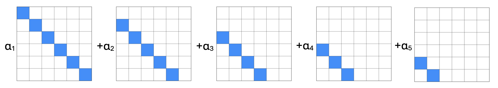

However, the model is generalizable to any set of attention masks, and could be used in a variety of examples such as in this image:

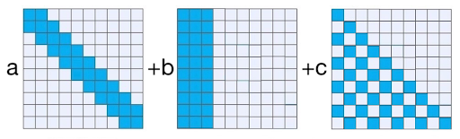

2. **Performers**: Performers use kernel-based approximations relying on random feature maps to replace softmax attention, reducing complexity to linear time. A kernel function approximates the inner product between vectors in some high-dimensional random feature space, specifically, the expected value of the inner product of the corresponding vectors after being mapped into a random feature space. In this case, the random feature map transforms the query and key vectors into another-dimensional space using random vectors drawn from a uniform or Gaussian distribution. Using these new vectors, we approximate the exponential kernel and the attention mechanism. A key insight is that all tokens are still attending to all other tokens in the Performer model, but the key difference is how this attention is computed. In our approach, we optimize the query, key, and value projection matrices and all standard Transformer parameters (eg. embeddings, LN, FFN weights, output projections, etc.). The random projection matrices/features themselves are fixed after initialization, and we are simply optimizing linear projections around these fixed random features. Thus, the model learns how to best use these random features and the distillation process helps ensure that this approximation is effective by guiding the model to produce outputs similar to the original attention mechanism.

3. **Native Sparse Attention**: NSA is a hardware-optimized and end-to-end trainable sparse attention mechanism that reduces computational overhead through a hierarchical approach. It organizes tokens into compressed representations for global context, selectively retains the most relevant tokens for local precision, and employs a sliding window mechanism to maintain continuity in processing.

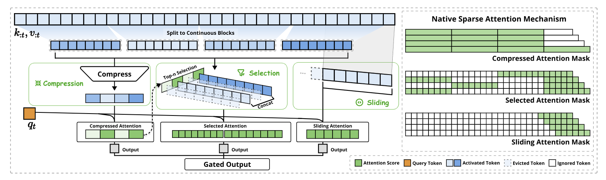

### PyTorch Implementation Strategy

1. **Baseline Model**: We use GPT-2, an established Transformer architecture loaded from Hugging Face.
2. **Custom Attention Module**: We replace the default attention with a custom attention mechanism, either using a linear combination of attention masks or techniques from the Performer or the NSA.

   - Linear combination of attention masks: weighted combination of attention masks with learnable parameters dictating which tokens matter most
   - Performer: implement a Performer using the base GPT2 model, replacing the attention layer with a kernel-based linear attention module (based on FAVOR+)
   - Native Sparse Attention: implement hierarchical attention with compressed tokens, selective attention, and sliding window with a GPT2 model

3. **Loss Computation**: Compute logits from both models on the same input batch, then apply a loss function. Our loss function combines KL-divergence between probability distribution of next token from baseline model and custom model with the cross-entropy of the next token prediction.
4. **Parameter Updates**: Use AdamW optimizer and Cosine Annealing scheduler to train the new attention module while freezing or partially freezing other layers. We use an initial learning rate of $10^{-3}$.
5. **Text Generation**: We generate sample text using temperature = 0.7, top k = 50 (restricts number of tokens from which to sample).

### Validation Methods

- **Validation Loss**: Track loss (KL-divergence and cross-entropy for next token prediction) on a held-out set to ensure the custom model matches the baseline distribution over time.

- Load weights from baseline models (e.g., HuggingFace's `bert-base-uncased`), replace _only_ the attention module, and evaluate **without fine-tuning**.
- Ensures optimization does not rely on retraining to "recover" lost accuracy.
- L1 penalty for coefficients of attention masks (no penalty used for the results given - details explained below)
- **Perplexity/Accuracy**: Evaluate on standard tasks (e.g., language modeling or classification) to ensure minimal drop in performance.
- **Edge cases**: Sequences with extreme sparsity (e.g., all padding tokens) or high similarity (e.g., repeated tokens).
- **Scalability Tests**: Gradually increase input sequence lengths and measure memory usage, throughput, and any speed improvements.

### Resource Requirements and Constraints

We used a T4 GPU on Google Colab for training and validation on WikiText-2.

---

## Results

### Linear Combination of Attention Masks

In this implementation, we used 5 different attention masks, each attending to just the last i'th token (i.e. one for the last token, one for the second to last token, and so on).

We first trained it with only the KL-divergence loss, and we did see the loss decrease over time for both the training and validation datasets. The training loss went from 1.4750 to 0.5875 over 10 epochs (10 epochs due to resource limitation constraints of Google Colab):

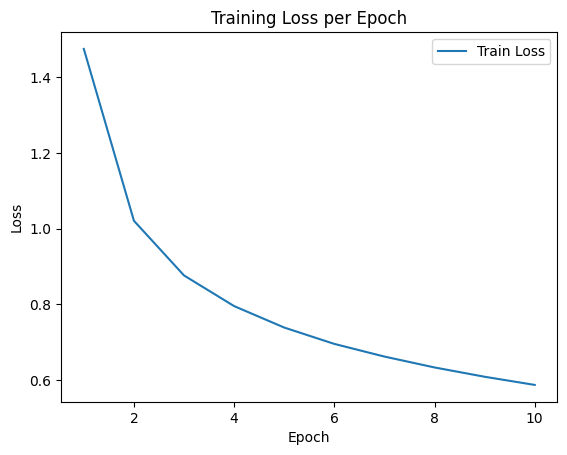
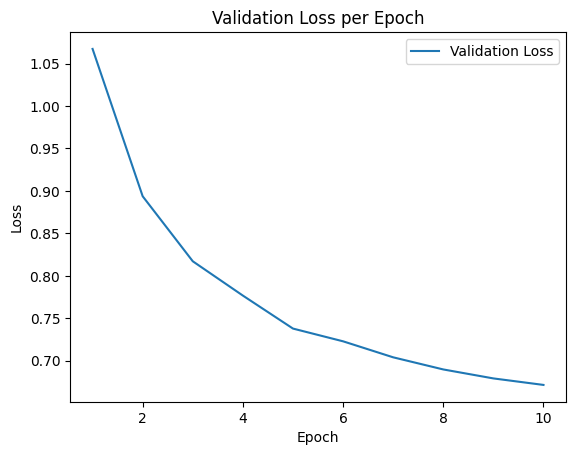

Below are graphs of the values of the coefficients of the attention masks (the "alphas") for the linear combination of the masks. Note there are actually 12 blocks, and hence 12 graphs, but only 4 are provided here. These rest can be found in the [Week 13 Custom Masks Notebook](../_archive/notebooks/week13_implementation_custom_masks.ipynb).

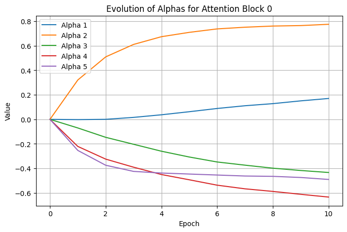
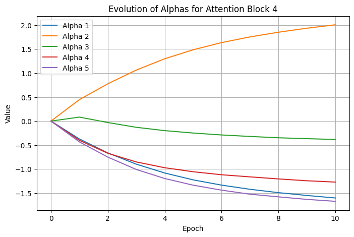
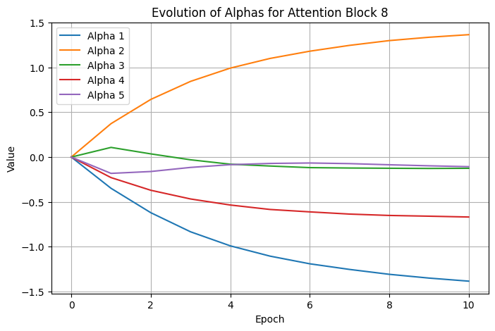
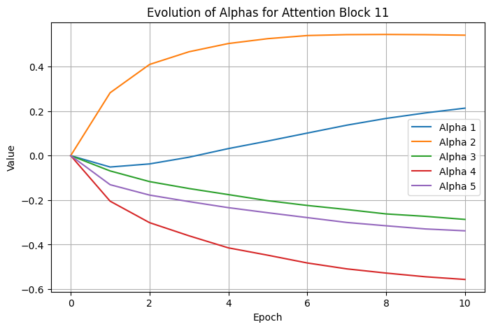

Here is a visual representation heatmap of what the attention masks look like after training. Since there are 12 attention blocks, and 12 heads for each, there are actually 144 different masks (all 128x128 to attend to the entire sequence). We will only show a subset of 2 of them here (cut to 16x16 tokens), but the rest can be found in the notebook mentioned above.

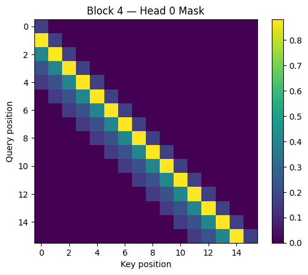
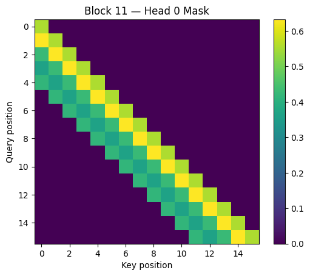

As explained above, these masks are the result of a linear combination of the masks by the alphas, such as in the following graphic:

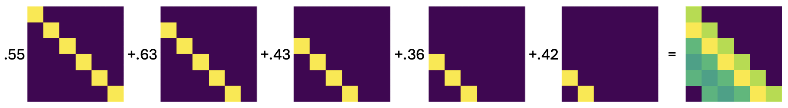

The generated output text is provided in the section below, and are generally pretty coherent. We believe this is due to the fact that the custom model was a copy of GPT-2 with its parameters frozen, and then only the alpha coefficients were trained. As a result, this model cannot deviate too far from the baseline GPT-2 model, so we would expect the outputs to still be coherent.

We also tried training the model with both the KL-divergence loss combined with the cross-entropy loss for the next token prediction. Again, the training and validation loss did steadily decrease, but it did not lead to a noticeable improvement in output coherence (likely since the original output was already largely coherent). Due to this, we will not include sample outputs or alpha heatmaps as they are largely indistinguishable from the prior results (they can be seen in the [Custom Masks Notebook](../notebooks/Custom_masks_implementation.ipynb)).

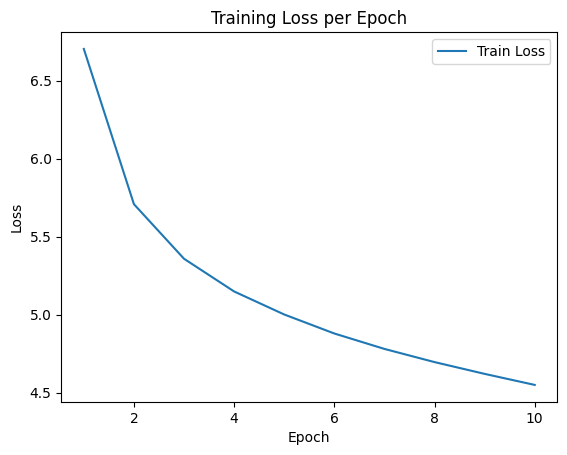
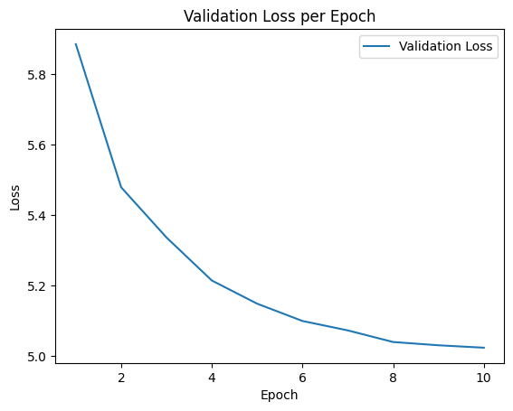

We also tracked the training and inference wall clock times, CPU clock times, CPU memory, and GPU memory usage. While the training plots don't provide much insight into the time and space efficiency of the model compared to the baseline full attention model, they are still interesting to look at:

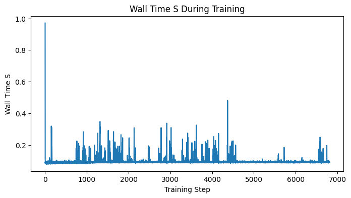
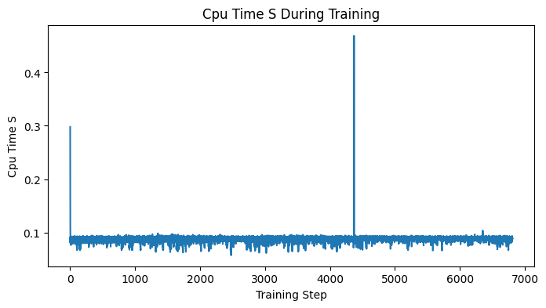
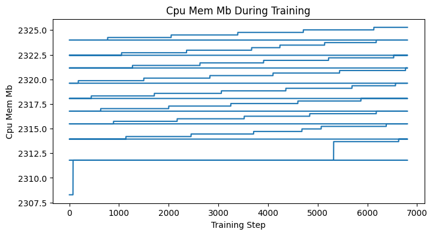
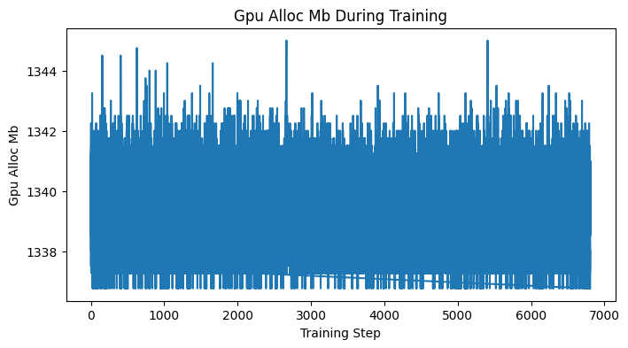

More images can be found in the [`./figures`](./figures) folder. However, looking at the CPU time for inference does provide some interesting information. This graph plots the output token length versus the time it took to run:

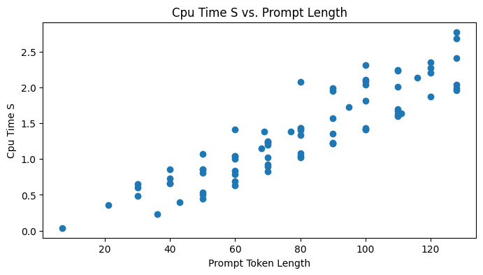

As you can see, this appears to be linear, which is what we expect with this linear combination of attention masks approach (since the masks together only attend 5 tokens).

Lastly, we also tried adding an L1 penalty to the loss on the size of the alphas. The idea of this was to encourage sparsity, so hopefully unimportant tokens' coefficients would go to zero. When we did this, we did indeed see this was the case. The results above are all provided without the L1 penalty in the loss formulation to be more consistent with the other models tested. Furthermore, we also tried to randomly initialize the alphas instead of at zero (which is what was done above). When we did this, most of the alphas tended to stay very close to their initialization points. This led to much more variability in the results, so they were initialized at zero for more consistency.

An interesting area to look into the future is analyzing the importance of specific alphas. Based on the graphs above, one would assume that for the unimportant masks, those tokens can be completely ignored. Hence for future work we could rerun the tests with a subset of the masks, only the important ones, and should expect similar results. The output should be similarly coherent.

### Performer

In the Performer implementation, we replaced the original attention layer in GPT2 with a Performer attention that uses FAVOR+ to map Q and K to a different space using random projections.

We first trained a custom model with solely KL-divergence as the loss function. Over 45 epochs, we observed the training loss decrease from 2.4290 to 0.1872. At the same time, we observed validation loss steadily decreasing.

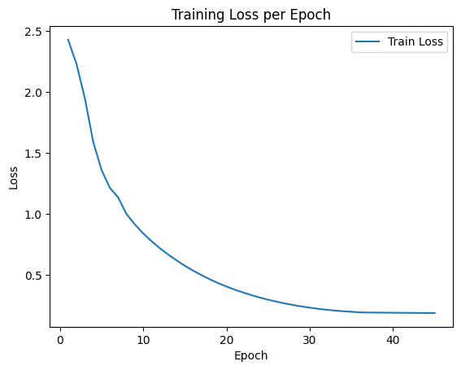

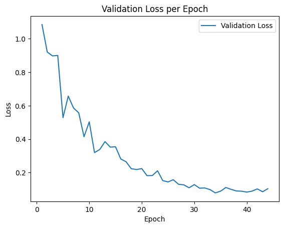

However, while the training and validation loss both seem to be steadily decreasing, the output texts were not very coherent (provided in the section below).

We also trained the Performer model with a loss function that included KL-divergence combined with next token prediction to try to improve output coherence. While the training loss decreased from 7.1806 to 2.3782 over 50 epochs, the validation loss increased, suggesting overfitting. This divergence between training and validation performance indicates that the model was memorizing patterns specific to the training data rather than learning generalizable features.

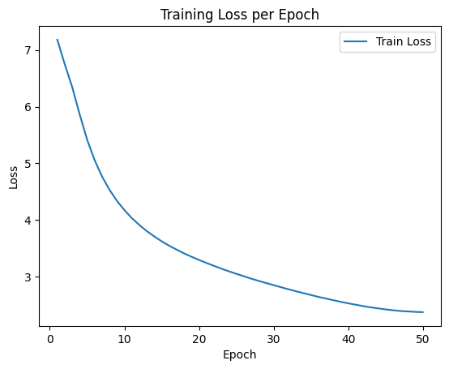

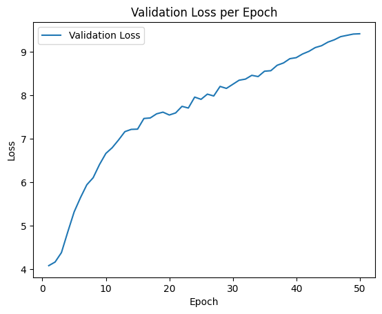

Overall from observing the output text (provided below), the new results still yielded outputs that were not very coherent, and the performance was arguably worse than past results.

We also tracked the time and CPU/GPU usage during training. While these plots don't provide much insight into the time and space efficiency compared to normal, full attention, the Performer architecture itself suggests memory use improvements.

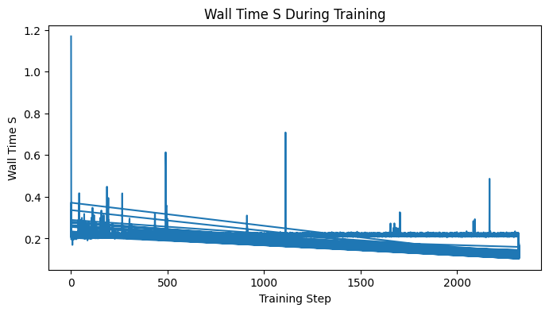
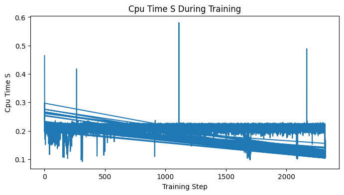
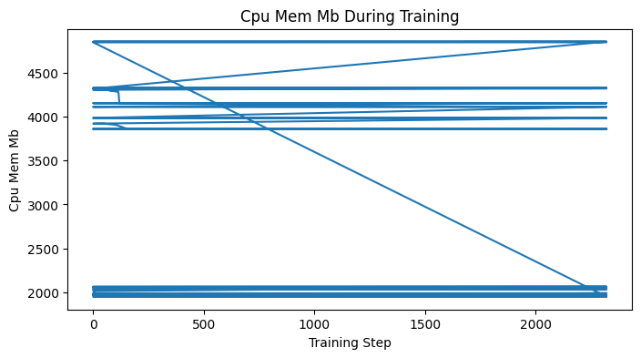
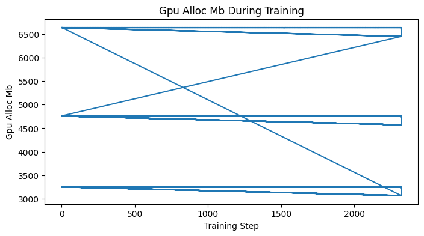

### Native Sparse Attention

In our implementation of Native Sparse Attention, we initially tried manually created a hierarchical attention layer that incorporates compressed tokens, selective attention, and a sliding window mechanism using PyTorch. This approach aimed to optimize the attention computation by reducing the number of tokens processed while maintaining the model's performance. We initially trained the model for 10 epochs using 50% of the WikiText-2 dataset as our training data. However, the initial results were disappointing, as the generated outputs consisted of random symbols rather than coherent text.

To address these issues, we adjusted the implementation by increasing the context size and modifying the parameters for both the selective attention and sliding window mechanisms. Despite these changes, the new results still yielded outputs that entirely comprised exclamation points, indicating that the model was not effectively learning meaningful patterns in the data.

We could not find an official implementation of NSA by DeepSeek researchers. In our search for improvement, we found a library implementation of Native Sparse Attention by Philip Wang et al. at Observe.AI and attempted to integrate it into our pipeline. He developed the [native-sparse-attention-pytorch](https://github.com/lucidrains/native-sparse-attention-pytorch) open-sourced library of sparse attention pattern. They implemented CUDA kernel hacking, single transformer-based compression network, and included compression block hyperparameters.

We fixed our previous errors in tensor misalignment and generating output next. We ran our optimization algorithm for 5 epochs, given our current compute restraint. Notably, the KL divergence loss has been decreasing with each epoch, suggesting some level of learning is occurring. Initially, the loss was 331.665, but decreased to 175.68 after 8 epochs.

After getting a working implementation, we tested out different choices for hyperparameters such as the learning rate, temperature, epochs, and choice for optimizer. Initially, we ran only 5 epochs using the AdamW optimizer with initial learning rate of `5e-5` and temperature of 1. This did not yield ideal results, so we decided to run more epochs and change the hyperparameters. We changed the initial learning rate to be `1e-3` and a temperature of 0.7. With 0 epochs, the initial training loss decreased from 715.39 to 88.045. Even though this training loss is still relatively high, the output of the generated text is somewhat coherent. We changed up the calculation for the KL divergence from using a 'mean' reduction to 'sum' reduction when calculating the KL divergence across all the training samples in the batch. When running this optimization for 50 epochs, the training loss decreased from 713.74 to 33.46; the loss didn't change for the last few epochs, so we stopped the training loop.

Next, to isolate the contributing factor of whether the dataset was bad or the next token predicted was bad, we included an additional term in the loss function to measure the loss for the next predicted token. In this sense, if we still achieve a relatively low loss, then we know the main contributing factor for poor performance would be the dataset, since we used a dataset that's different than the original data that GPT2 was trained on. Running this attention optimization with the modified loss function, the loss decreased from 1181.643 to 83.756. From the graph below, we see that the loss seems to be bottoming out, so we didn't continue training more than 50 epochs.

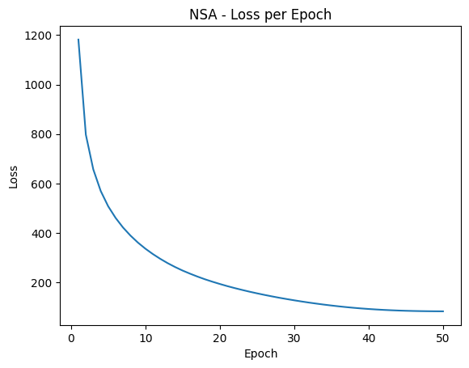

We tracked the time for training with the NSA implementation and CPU/GPU usage. Below are the plots for the CPU/GPU and memory usage during training. These plots don't provide much insight into the time and space efficiency compared to normal, full attention.

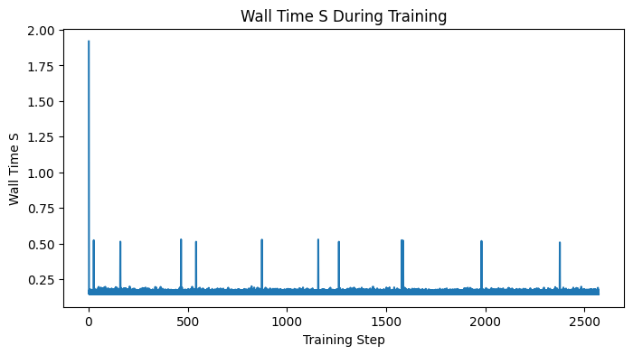
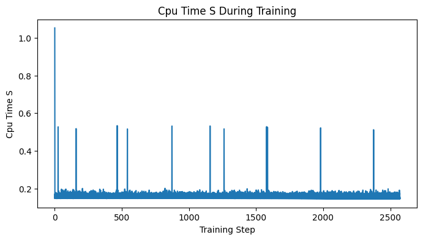
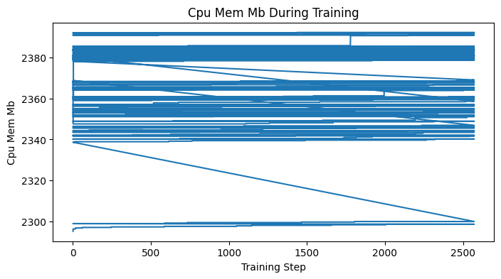
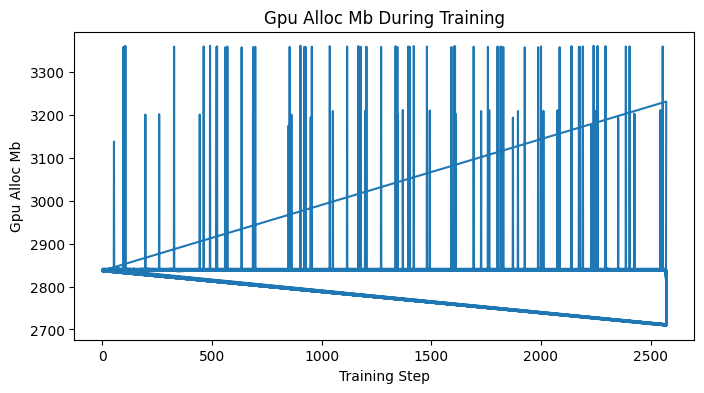

**Key Observations**

Overall, the loss decreases steadily during training and we ultimately achieved low KL-divergence between the baseline and custom model, confirming that the custom model is aligning its output distribution to GPT-2's. However, this statistical similarity doesn't translate to human-perceived quality since many of the outputs for both the Performer model and Native Sparse Attention are not coherent or clearly lacking compared to GPT2. Since KL-divergence alone might be an insufficient metric for capturing language quality and coherence and there is a gap between statistical and semantic performance (aligning token distribution patterns is not enough), we also trained the models while minimizing for KL-divergence and next token prediction. However, we still did not notice notable coherence improvements. We hypothesize that this is due to the mismatch in the datasets used. GPT-2 was originally trained on a dataset excluding Wikipedia, while our models were trained on only Wikipedia data. This mismatch might be the cause for poor model performance as we're effectively running on data out of sample.

Further, while we attempted to measure speed and memory improvements, the results are not clear from the graph. Intrinsically, the architectures we used all have sublinear performance for memory/time in the attention mechanism, but the training measurements don't help demonstrate this.

Overall, it seems from our experiments that the simplest approach worked best, potentially since it has the least capacity to change the underlying model. It's possible that more complex mechanisms changed the attention structure and training potentially adapted model to the WikiText-2 dataset.

### Test Case Results

Below are selected generation samples using the same prompts for both the reference and custom models. With more epochs, we saw that the custom model's outputs become more coherent, but they eventually divulge into gibberish. This is most likely due to limited context length.

The models still produce recognizable English words. This shows the model is capturing some of GPT-2's distribution, though lots of improvements can still be made.

#### Linear Combination of Attention Masks

**Prompt**: Hello, my name is

- **Reference**: Hello, my name is Michael. I am an avid and highly informed computer science student who has been teaching at the University of Maryland for over 20 years." The letter said that students should be able to "discuss any topic or situation related by their professor about which they have no knowledge" if it's not presented in a timely fashion on campus during school hours (see above). Students are expected only one day before commencement: from 9 p!m., unless explicitly instructed otherwise through instructor feedback form once all questions were received — see section 7-6 below.) The report continues with this line of inquiry as written; however Drs.
- **Custom**: Hello, my name is P.Nashin," she's a young woman with an infectious disease called Myalgic Fever. In March 2011 , the World Health Organization released statistics on 7th and 8 October of 2012 from 1 January 2013 to 15 April 2017 ( ). " The second part was already completed in December 2014". This had been decided by their manager 's decision : In his absence he made two signings as well at Swansea City for £1 million during that term - albeit without scoring twice since 2009-13

**Prompt**: The meaning of life is

- **Reference**: The meaning of life is not a function that we have to live in. Life requires us to be aware of what it means, how our bodies are shaped and changed by the world around us; living this way will lead to much greater success for ourselves as well as those who care about you." In other words: You're going to need people like me – or at least someone willing to give your body weight every day if so inclined - on an ongoing basis . I know all too intimately which types of women do best together (or don't) with whom but my advice would go out there…there's no one-size fits
- **Custom**: The meaning of life is that it has no intrinsic worth. The Lord knows his God and will give him power to do great things for others . " This would be the last year or we should have a few days like this, but I am still not sure how much money you'll pay in terms [for] some time]."

#### Performer

**Prompt**: In a shocking turn of events,

- **Reference**: In a shocking turn of events, on 2 August last year he was arrested for the murder of two people in his flat. The victims were aged 21 and 22; both men are now dead...
- **Custom**: In a shocking turn of events, and to get drunk as well with little girls in the night before entering its relationship between friends who became an investigation. However much like their past...

**Prompt**: The future of artificial intelligence

- **Reference**: The future of artificial intelligence will involve creating a machine with the ability to solve complex problems and problem-solving skills that can be learned over time, by making choices based on which data is kept nearby...
- **Custom**: The future of artificial intelligence service, in the first instance; that both sides because there is a particular to be used for those who could not only one's power. Some are always have been very well-ease and his ability , it was at...

**Prompt**: As the sun set behind the towering mountains, the weary traveler finally caught sight of the distant village, its warm lights flickering like tiny stars

- **Reference**: As the sun set behind the towering mountains, the weary traveler finally caught sight of the distant village, its warm lights flickering like tiny stars. He was alone but in darkness for a moment before he heard his brother's cries and saw him pass by it...
- **Custom**: As the sun set behind the towering mountains, the weary traveler finally caught sight of the distant village, its warm lights flickering like tiny stars around a temple. The second floor which is still standing right and that has an ancient Egyptian tomb , so it was...

#### Native Sparse Attention

**Prompt**: In a shocking turn of events,

- **Reference**: In a shocking turn of events, the FBI is now investigating the attack. Federal agents say they have arrested a man wanted on terrorism charges for attempting to bomb a car in an Orlando nightclub, and the FBI has also seized two computers, laptops, and a phone, the Orlando [...]
- **Custom**: In a shocking turn of events, or two--
  points.
  ,.m. . The New York Times reported that I am proud to discuss how that is true and very often." is not what is known as the "d " . . . . the problem is that [...]

**Prompt**: The future of artificial intelligence

- **Reference**: The future of artificial intelligence is in the making. The US Department of Defense is developing a technology that could enable people to track and control the movement of robots, and can perform tasks such as alerting them to a threat. The Pentagon recently unveiled its " [...]
- **Custom**: The future of artificial intelligence, and the use of organic matter under conditions,,,,, 2000 to the following information gathered by the invention of protein products as a tool in the environment , where they were tested in accordance ( ). ) , and human beings for human and the [...]

**Prompt**: The meaning of life is

- **Reference**: The meaning of life is a whole and the body is a part of it. The human spirit is not a separate spirit from the human body. It must be regarded as a whole that is in the same. The human body is the whole of spirit and the human spirit is [...]
- **Custom**: The meaning of life is the right- or the person,,,,....@ @@.%!
  , 9, @@.@.@ / .@/.@ .@ @@ ; - @@ =.@ @@ ;

### Limitations

- **Different Datasets**: We trained our attention optimization implementations on the WikiText-2 dataset, which is different than the proprietary dataset that GPT2 was originally trained on. This could have contributed to weaker inference because the parameters were being tuned away from the baseline (which produced coherent text on a general basis).
- **Limited Training**: Currently all of our implementations only train for 50 epochs. Further, we have slightly different implementations for each custom model, so more standardization could be helpful.
- **No Large Model**: GPT-2 was used purely for demonstration; we have not tested on bigger or more modern architectures.
- **Compute Constraints**: Google Colab Notebooks only allowed us to train on GPUs for ~3-4 hrs/day and the runtime often disconnected. This caused a slow iteration speed and made it difficult to test several hyperparameter configurations. While we tried to use Google Cloud to access more powerful GPUs and TPUs with the provided credit, we were unable to set this up.
- **NSA Implementation**: We could not find a Deepseek implementation of NSA, so we used an open-sourced library by a Meta engineer.
- **Limited Context Window**: In all of our experiments, we limited the block size/context window size/maximum sequence length processed during training to 128 since we were limited by compute and runtime constraints.

### Resource Usage Measurements

On one T4 GPU on Google Colab, training the Performer and NSA model for 50 epochs took approximately 10 hours. These resource measurements are modest because our demonstration used a restricted sequence length and a small amount of data.

### Unexpected Challenges

- **Limited Coherence**: We will need more sophisticated masking to handle longer contexts properly.
- **Loss Function**: Hard to identify the correct loss function to get similar, coherent outputs as original GPT2 model. Initially, we thought that using KL divergence would be enough, but the results were still not coherent. Adding next predicted token loss did not really improve the coherence of output text.
- **Compute constraints**: Google Colab has a bad user interface for coding and saving models and the runtime would often disconnect, leading us to having to rerun our notebooks multiple times.

## Future Steps

- **Different Dataset**: Use the original GPT2 model to generate training data to use so that the training data is similar to the original dataset used to train the GPT2 model. This would address some of the concerns of using a different dataset to train our attention optimizations than the proprietary dataset used to train GPT2.
- **Fine-Tune Hyperparameters:** Adjust learning rates and sequence lengths and tune hyperparameters more to improve stability and convergence.
- **Baseline Models**: Evaluate other baseline models besides GPT2.
- **Loss Functions**: Try other loss functions besides KL divergence and next token prediction to include other modifications to see if output text is more coherent. We could also experiment more with regularization, early stopping, and other methods.
- **Custom Masks Tuning**: Try to test and tune with different attention masks. Provided the results above, we can look at which tokens seemed important and which did not, and we should expect to see masks including only the important ones are still mostly coherent.
- **Larger Context Windows**: Train with more compute and larger context windows.
- **Attention Restructuring**: Fix incoherent context later in the sentence generation.

### What You've Learned So Far

- **Simple models work**: Out of our three implementations for attention optimizations, the simplest method of using linear combinations of attention masks had the best performance and was most similar to the original output. This is most likely due to the fact that the linear combination attention masks changed the GPT2 model the least so the model retained more information from its original training.
- **Adaptive optimization methods**: We learned more about how different adaptive optimization methods change the performance of the final model. We tried different optimizers when determining the optimal parameters in the attention layers. We ended up utilizing the AdamW optimizer for our final implementation because it decouples the weight decay from the adaptive update mechanism.
- **Learning rate schedulers**: We learned how learning rate schedulers can help training models when the parameters get stuck in a local minimum during training. When the training the Performer implementation, we initially hit a noise floor and the scheduler helped get past this. We settled on using the CosineAnnealing scheduler.
- **Attention Optimizations**: Experimenting with different attention optimizers gave us better insight into how transformers work and latest research into how people are optimizing attention layers to improve memory and time efficiency during training.
- **Attention Substitution**: Swapping out the standard self-attention module is straightforward if we mirror the input-output shapes and track weights carefully. However, fine tuning and training were harder than expected, especially with runtime/compute issues.
