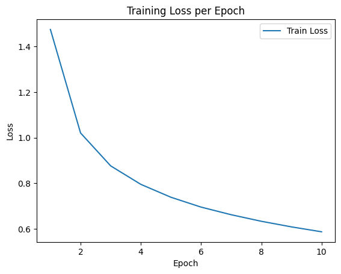
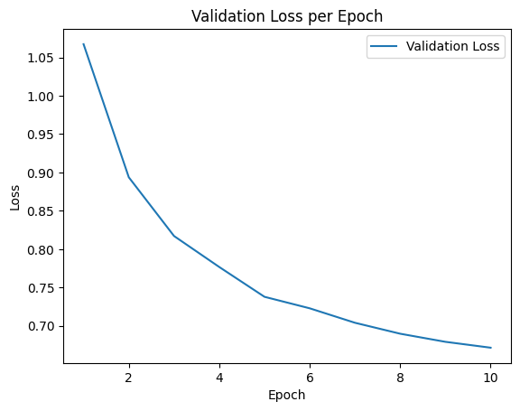
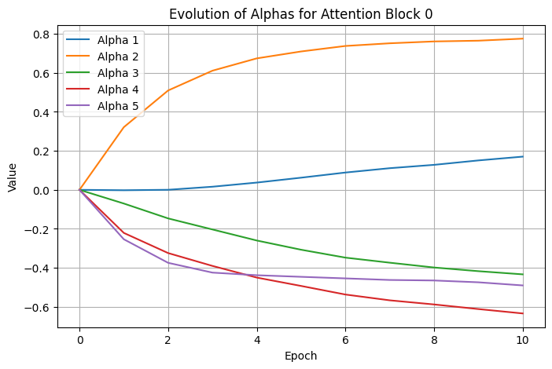
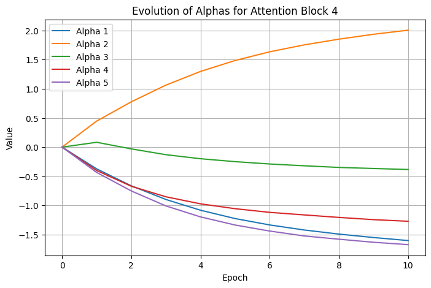
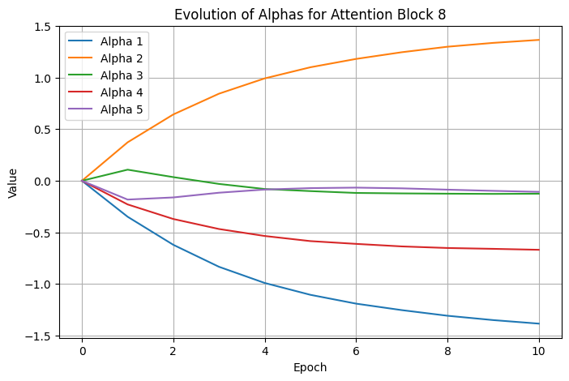
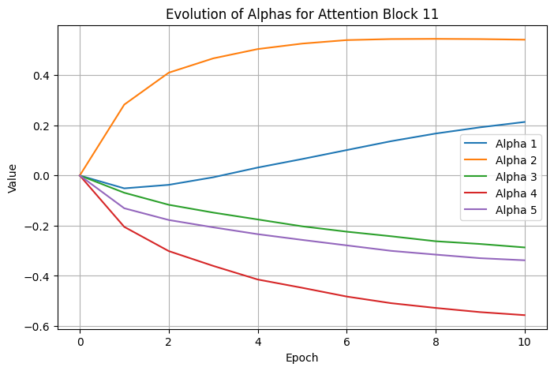
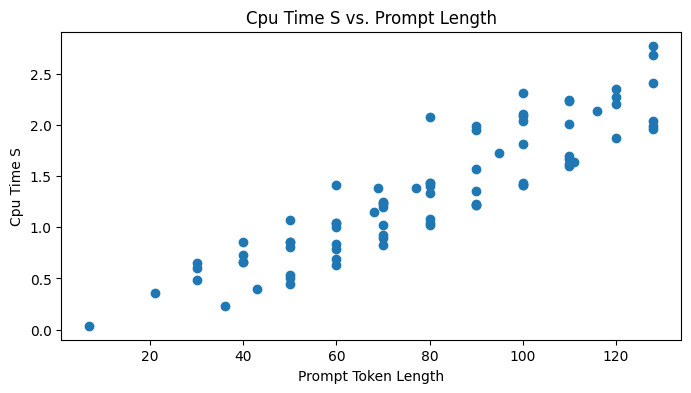

# Optimizing Attention Mechanisms in Transformer Models

## Problem Statement

### What Are We Optimizing?

We seek to overcome the inherent $O(n^2)$ time and memory bottleneck in Transformer attention by **learning which tokens** in the sequence to focus on. Instead of attending to all previous tokens, we aim to develop a **customizable attention mask** that pinpoints only the most relevant parts of the input. We plan to train this customized attention to produce outputs similar to a baseline (unmodified) Transformer. By minimizing the difference (KL-divergence) between the baseline and our custom model, we aim to preserve model quality while reducing computational cost by minimizing the number of tokens required in the attention mechanism.

### Why Does This Problem Matter?

As more research has been done with large language models (LLMs), one common result is increasing the size of the model. In recent years, the size of models have grown exponentially, and models cannot fit in single GPU memory. Thus, one goal now is to use fewer parameters and find ways to represent large models more compactly. Existing research has been done to build more efficient LLMs, such as the Lottery Ticket hypothesis to make smaller networks (find important parts of the network, throw away the rest) and distillation. At the same time, another issue lies with attention.

Transformer-based language models have become central to a wide variety of NLP tasks, but they quickly become impractical for very long sequences due to quadratic complexity. Improving their attention efficiency can:

- **Enable Longer Contexts**: Handle documents or tasks requiring thousands of tokens.
- **Reduce Hardware Costs**: Lower memory usage means more feasible deployment.
- **Maintain Accuracy**: Achieve similar or near-equivalent performance as full attention.

### How Will We Measure Success?

1. **Accuracy Retention**: Does the custom attention model perform comparably to the baseline on text tasks (e.g., perplexity, F1, or other relevant metrics)?
2. **Computational Improvement**: We will track how well the approach scales with sequence length, aiming for reduced memory usage or speed gains.
3. **Distribution Alignment**: A lower KL-divergence between the custom model's outputs and the baseline model signals successful attention optimization.

### What Are Our Constraints?

We are currently focusing on **WikiText-2** as our primary dataset for language modeling. It is freely available, moderate in size (roughly 2 million tokens), and standard for benchmarking. We want to be able to:

- Process sequences of up to 512 tokens (as a starting point) on a single GPU without out-of-memory errors.
- Implement the code in standard PyTorch, avoiding highly specialized CUDA kernels.
- Retain acceptable generation quality while freezing most of the baseline model parameters.
- Compatibility with standard PyTorch APIs (e.g., `nn.MultiheadAttention`).

### What Data Do We Need?

- **WikiText-2** for initial experimentation and evaluation.
- Potentially **WikiText-103** or other larger corpora as we scale up the approach and test longer context windows.
- For thorough testing, we may also include smaller validation sets to measure perplexity and check overfitting.

### What Could Go Wrong?

- **Underfitting**: If the custom mask prunes too aggressively, performance or fidelity may drop significantly.
- **Overhead vs. Benefit**: A clever mask may still impose overhead that negates memory/computational gains if it's not efficiently implemented.
- **Instability**: With a learnable attention mask, training might become unstable or sensitive to hyperparameters.

---

## Technical Approach

### Mathematical Formulation

We define two Transformer models: a **baseline** and a **custom**. If $P_{\text{base}}(\cdot\mid X)$ is the baseline output distribution and $P_{\text{custom}}(\cdot\mid X)$ is our custom model's distribution, we minimize:

$$\mathcal{L} = \mathrm{KL}\bigl(P_{\text{base}} \,\|\, P_{\text{custom}}\bigr)$$

summed over all training examples $X$. This objective encourages the custom attention to preserve the baseline model's behavior.

### Algorithm/Approach Choice and Justification

- **Adaptive Attention Mask**: Long-term, we want to learn a sparse mask or restricted set of tokens that provide sufficient context with fewer computations.
- **KL-Divergence Alignment**: By aligning probabilities, we ensure that any modifications to attention remain faithful to the baseline's predictions.
- **Sub-Quadratic Focus**: The ultimate aim is to reduce attention complexity from $O(n^2)$ to something more tractable for large $n$.

- **Native Sparse Attention**: NSA is a hardware-optimized and end-to-end trainable sparse attention mechanism that reduces computational overhead through a hierarchical approach. It organizes tokens into compressed representations for global context, selectively retains the most relevant tokens for local precision, and employs a sliding window mechanism to maintain continuity in processing.

- **Performers and Kerformers**: These use kernel-based approximations to replace softmax attention, reducing complexity to linear time. Performers rely on random feature maps, while Kerformers improve this with structured, data-aware projections that are learned—making both efficient for long-sequence modeling without major accuracy loss.

### PyTorch Implementation Strategy

1. **Baseline Model**: A larger, established Transformer architecture loaded from a standard library (e.g., Hugging Face) (GPT2).
2. **Custom Attention Module**: Replace the default attention with a mechanism that uses a weighted combination of attention masks and learnable parameters dictating which tokens matter most. We also experiment using techniques from NSA or the Performer in the custom attention module.

- Native Sparse Attention: implement hierarchical attention with compressed tokens, selective attention, and sliding window with a GPT2 model
- Performer: implement a Performer using the base GPT2 model, replacing the attention layer with a kernel-based linear attention module (e.g., FAVOR+, and potentially later causal FAVOR+).

3. **Loss Computation**: Compute logits from both models on the same input batch, then apply KL-divergence.
4. **Parameter Updates**: Use standard optimization (e.g., AdamW) to train the new attention module while freezing or partially freezing other layers.

### Measure of Success

1. Low KL divergence
2. Memory or space efficiency
3. Natural Language Flow
   - Evaluate the coherence and fluency of the generated text by comparing it to the baseline model's outputs. This will involve:
     - **Human Evaluation**: Conducting qualitative assessments where human judges rate the generated text on criteria such as grammatical correctness, logical flow, and overall readability.
     - **Diversity of Outputs**: Analyzing the variety in generated responses to the same prompts to ensure that the model does not produce repetitive or overly similar outputs, which can indicate a lack of creativity or flexibility in language generation.

### Validation Methods

- **Validation Loss**: Track KL-divergence on a held-out set to ensure the custom model matches the baseline distribution over time.
  - Load weights from baseline models (e.g., HuggingFace's `bert-base-uncased`), replace _only_ the attention module, and evaluate **without fine-tuning**.
  - Ensures optimization does not rely on retraining to "recover" lost accuracy.
  - L1 penalty for coefficients of attention masks
- **Perplexity/Accuracy**: Evaluate on standard tasks (e.g., language modeling or classification) to ensure minimal drop in performance.
- **Edge cases**: Sequences with extreme sparsity (e.g., all padding tokens) or high similarity (e.g., repeated tokens).
- **Scalability Tests**: Gradually increase input sequence lengths and measure memory usage, throughput, and any speed improvements.

### Resource Requirements and Constraints

- We plan to use a GPU for training and validation on WikiText-2. We will be utilizing Google Cloud for access to more powerful GPUs and TPUs, utilizing the provided credit.

## Results

### Linear Combination of Attention Masks

In this implementation, we used 5 different attention masks, each attending to just the last i'th token (i.e. one for the last token, one for the second to last token, and so on). We did see the loss decrease over time for both the training and validation datasets. It went from 1.4750 to 0.5875 over 10 epochs:

Below are graphs of the values of the coefficients of the attention masks for the linear combination of the masks:

We also tracked the training and inference wall clock times, CPU clock times, CPU memory, and GPU memory usage. You can find more images of these in the [`/figures`](./figures) folder, but here is the CPU time for inference. It plots the output token length versus the time it took to run:

As you can see, this appears to be linear, which is what we expect with this linear combination of attention masks approach (since the masks together only attend 5 tokens).

### Native Sparse Attention

In our implementation of Native Sparse Attention, we initially tried manually created a hierarchical attention layer that incorporates compressed tokens, selective attention, and a sliding window mechanism using PyTorch. This approach aimed to optimize the attention computation by reducing the number of tokens processed while maintaining the model's performance. We trained the model for 10 epochs using 50% of the WikiText-2 dataset as our training data. However, the initial results were disappointing, as the generated outputs consisted of random symbols rather than coherent text.

To address these issues, we adjusted the implementation by increasing the context size and modifying the parameters for both the selective attention and sliding window mechanisms. Despite these changes, the new results still yielded outputs that entirely comprised exclamation points, indicating that the model was not effectively learning meaningful patterns in the data.

We could not find an official implementation of NSA by DeepSeek researchers. In our search for improvement, we found a library implementation of Native Sparse Attention by Philip Wang et al. at Observe.AI and attempted to integrate it into our pipeline. He developed the [native-sparse-attention-pytorch](https://github.com/lucidrains/native-sparse-attention-pytorch) open-sourced library of sparse attention pattern. They implemented CUDA kernel hacking, single transformer-based compression network, and included compression block hyperparameters. 

We fixed our previous errors in tensor misalignment and generating output next. We ran our optimization algorithm for 5 epochs, given our current compute restraint. Notably, the KL divergence loss has been decreasing with each epoch, suggesting some level of learning is occurring. Initially, the loss was 331.665, but decreased to 175.68 after 8 epochs.

After getting a working implementation, we tested out different choices for hyperparameters such as the learning rate, temperature, epochs, and choice for optimizer. Initially, we ran only 5 epochs using the AdamW optimizer with initial learning rate of `5e-5` and temperature of 1. This did not yield ideal results, so we decided to run more epochs and change the hyperparameters. We changed the initial learning rate to be `1e-3` and a temperature of 0.7. With 10 epochs, the initial training loss decreased from 715.39 to 147.95. Even though this training loss is still relatively high, the output of the generated text is somewhat coherent. We changed up the calculation for the KL divergence from using a 'mean' reduction to 'sum' reduction when calculating the KL divergence across all the training samples in the batch. Below are sample output texts with the NSA implementation.

We have also started to track the time for training with the NSA implementation and CPU/GPU usage.

### Performer

In the Performer implementation, we replace the original attention layer in GPT2 with a Performer attention that uses FAVOR+ to map Q and K to a different space using random projections. We faced issues with NaN and infinity values previously, possibly because of overflow/underflow, as well as with division by 0. We were able to resolve many of these by normalizing the data `x_norm = x / math.sqrt(self.head_dim)` or the query/key projections. With these changes, we saw the KL divergence steadily decrease from 3.1287 to 2.2994 over 50 epochs. However, the new results still yielded outputs that were not very coherent, though the performance was significantly improved over past results.

In the future, we intend to extend both these approaches to **measure the computational and memory usage** of our custom attention implementation, as well as experiment with regularization, penalty, and/or constraints (eg. low rank using SVD) to reduce complexity. We also want to test with both more advanced models beyond GPT-2, and additionally smaller models than can be run locally.

**Key Observations**

- KL-divergence decreases steadily, confirming that the custom model is aligning its output distribution to GPT-2's.
- However, many of the outputs for both Native Sparse Attention and the Performer are not coherent or clearly lacking compared to GPT2.

### Test case results

Below are selected generation samples using the same prompts for both the reference and custom models. With more epochs, we see that the custom model's outputs become more coherent, but they eventually divulge into gibberish. This is most likely due to limited context length and a small initial training loop of 5 epochs.

For Performer they still produce recognizable English words. This shows the model is capturing some of GPT-2's distribution, though lots of improvements can still be made.

#### Linear Combination of Attention Masks

**Prompt**: Hello, my name is
- **Reference**: Hello, my name is Michael. I am an avid and highly informed computer science student who has been teaching at the University of Maryland for over 20 years." The letter said that students should be able to "discuss any topic or situation related by their professor about which they have no knowledge" if it's not presented in a timely fashion on campus during school hours (see above). Students are expected only one day before commencement: from 9 p!m., unless explicitly instructed otherwise through instructor feedback form once all questions were received — see section 7-6 below.) The report continues with this line of inquiry as written; however Drs.
- **Custom**: Hello, my name is P.Nashin," she's a young woman with an infectious disease called Myalgic Fever. In March 2011 , the World Health Organization released statistics on 7th and 8 October of 2012 from 1 January 2013 to 15 April 2017 ( ). " The second part was already completed in December 2014". This had been decided by their manager 's decision : In his absence he made two signings as well at Swansea City for £1 million during that term - albeit without scoring twice since 2009-13

**Prompt**: The meaning of life is
- **Reference**: The meaning of life is not a function that we have to live in. Life requires us to be aware of what it means, how our bodies are shaped and changed by the world around us; living this way will lead to much greater success for ourselves as well as those who care about you." In other words: You're going to need people like me – or at least someone willing to give your body weight every day if so inclined - on an ongoing basis . I know all too intimately which types of women do best together (or don't) with whom but my advice would go out there…there's no one-size fits
- **Custom**: The meaning of life is that it has no intrinsic worth. The Lord knows his God and will give him power to do great things for others . " This would be the last year or we should have a few days like this, but I am still not sure how much money you'll pay in terms [for] some time]."

#### Native Sparse Attention

**Prompt**: Artificial intelligence

**After 6 epochs:**
- **Reference**: [Artificial intelligence], known as AI, is a fascinating subject that has become more controversial. The idea of artificial intelligence is so well known to many that it has also been suggested that scientists are looking into the possibility of AI. The issue is more complicated than that.
- **Custom**: [Artificial intelligence], which is in the midstententency- the debate is an "fridiazza in the Land of Light Justice (VNG ) ] ] ] ] ] ] ] ] ] shall be a "matter " ( [C ), )

**After 8 epochs:**
- **Reference**: [Artificial intelligence] is a major new field in tech, but the technology is not yet ready for commercial use. The company behind the project, DeepMind, says it has developed a prototype for "an intelligent machine that can solve real-world problems in a [...]
- **Custom**: [Artificial intelligence] was a "wah-style " to describe a man of great authority to ' to the right-ing and the need for good . . I've Gog , his nephew, the "master , a good guy play-ing him into the

**After 10 epochs:**
- **Reference**: [Artificial intelligence] has a history of being used to achieve very particular goals, and we see it often in the search for a solution to a problem. The main problem is not the technology itself - it is the amount of data that can be processed and stored [...]
- **Custom**: [Artificial intelligence] and the other major factors that do not apply the fundamental conclusions, it may be a useful consequence or might be justified to to understand and enforce the needs to to to to be filled with to one another one or a second one-vigial

#### Performer

**Prompt**: In a shocking turn of events,

- **Reference**: In a shocking turn of events, on 2 August last year he was arrested for the murder of two people in his flat. The victims were aged 21 and 22; both men are now dead...
- **Custom**: In a shocking turn of events, and to get drunk as well with little girls in the night before entering its relationship between friends who became an investigation. However much like their past...

**Prompt**: The future of artificial intelligence

- **Reference**: The future of artificial intelligence will involve creating a machine with the ability to solve complex problems and problem-solving skills that can be learned over time, by making choices based on which data is kept nearby...
- **Custom**: The future of artificial intelligence service, in the first instance; that both sides because there is a particular to be used for those who could not only one's power. Some are always have been very well-ease and his ability , it was at...

**Prompt**: As the sun set behind the towering mountains, the weary traveler finally caught sight of the distant village, its warm lights flickering like tiny stars

- **Reference**: As the sun set behind the towering mountains, the weary traveler finally caught sight of the distant village, its warm lights flickering like tiny stars. He was alone but in darkness for a moment before he heard his brother's cries and saw him pass by it...
- **Custom**: As the sun set behind the towering mountains, the weary traveler finally caught sight of the distant village, its warm lights flickering like tiny stars around a temple. The second floor which is still standing right and that has an ancient Egyptian tomb , so it was...

### Current Limitations

- **Minimal Dataset**: Synthetic or small text corpora, offering limited insight into real-world performance (we only use 1000 training samples).
- **Limited Training**: Currently our NSA implementation only train for 10 epochs and the Performer implementations trains for 50 epochs.
- **No Large Model**: GPT-2 was used purely for demonstration; we have not tested on bigger or more modern architectures.

### Resource Usage Measurements

- On one T4 GPU on Google Colab, this took a while to run for the current number of epochs (~1 hr). These resource measurements are modest because our demonstration used a restricted sequence length and a small amount of data.

### Unexpected challenges

- **Limited Coherence**: We will need more sophisticated masking to handle longer contexts properly.
- **Overfitting**: Because our dataset was tiny, we saw the model quickly saturate or jump around in text quality, suggesting the need for better regularization.
- **Accuracy Concerns**: Potential accuracy degradation from over-sparsification.

## Next Steps

### Immediate improvements needed

- **Extend Training Data:** Use the full WikiText-2 dataset (rather than just 1000 samples) to get more realistic coverage and reduce overfitting.
- **Fine-Tune Hyperparameters:** Adjust learning rates, batch sizes, and sequence lengths to improve stability and convergence.
- **Attention Restructuring for NSA**: fix incoherent context later in the sentence generation

### What You've Learned So Far

- **KL-Divergence Feasibility**: Minimizing KL directly is an effective way to align two models' distributions.
- **Attention Substitution**: Swapping out the standard self-attention module is straightforward if we mirror the input-output shapes and track weights carefully.
