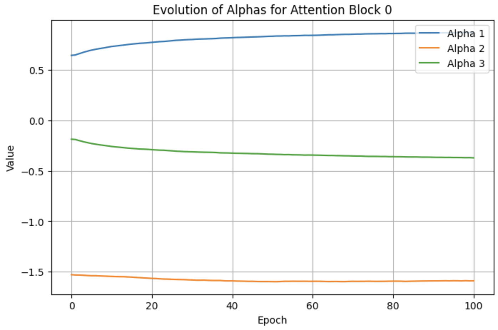
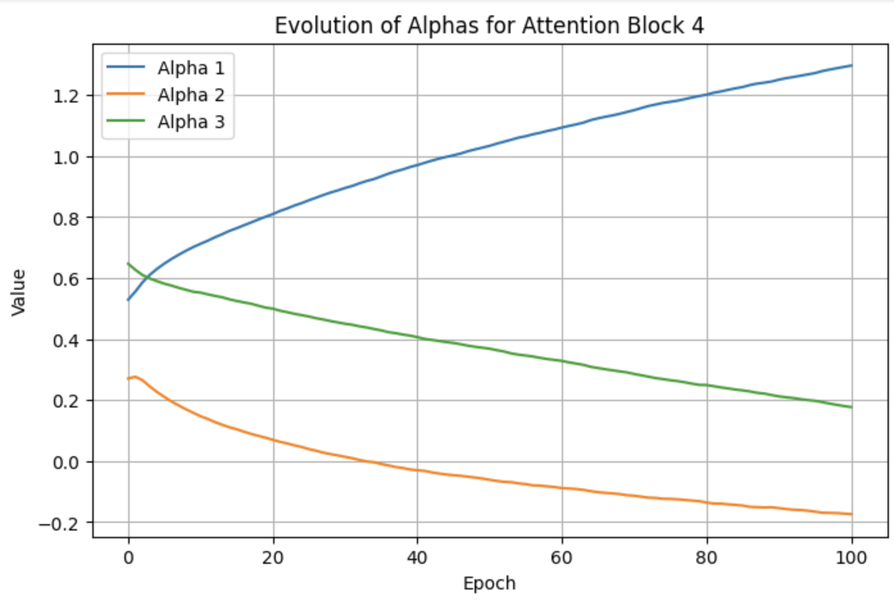
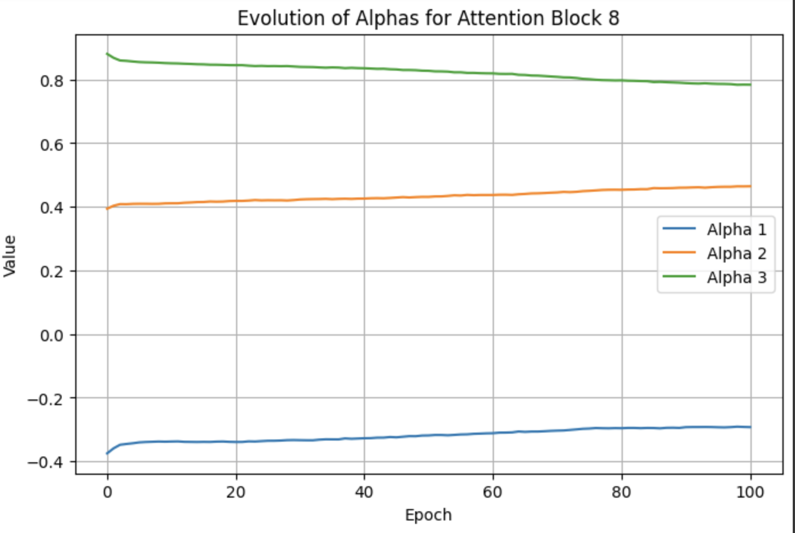
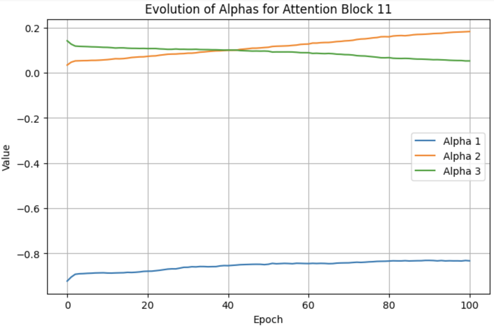

# Optimizing Attention Mechanisms in Transformer Models

## Problem Statement

### What Are We Optimizing?

We seek to overcome the inherent $O(n^2)$ time and memory bottleneck in Transformer attention by **learning which tokens** in the sequence to focus on. Instead of attending to all previous tokens, we aim to develop a **customizable attention mask** that pinpoints only the most relevant parts of the input. We plan to train this customized attention to produce outputs similar to a baseline (unmodified) Transformer. By minimizing the difference (KL-divergence) between the baseline and our custom model, we aim to preserve model quality while reducing computational cost by minimizing the number of tokens required in the attention mechanism.

### Why Does This Problem Matter?

As more research has been done with large language models (LLMs), one common result is increasing the size of the model. In recent years, the size of models have grown exponentially, and models cannot fit in single GPU memory. Thus, one goal now is to use fewer parameters and find ways to represent large models more compactly. Existing research has been done to build more efficient LLMs, such as the Lottery Ticket hypothesis to make smaller networks (find important parts of the network, throw away the rest) and distillation. At the same time, another issue lies with attention.

Transformer-based language models have become central to a wide variety of NLP tasks, but they quickly become impractical for very long sequences due to quadratic complexity. Improving their attention efficiency can:

- **Enable Longer Contexts**: Handle documents or tasks requiring thousands of tokens.
- **Reduce Hardware Costs**: Lower memory usage means more feasible deployment.
- **Maintain Accuracy**: Achieve similar or near-equivalent performance as full attention.

### How Will We Measure Success?

1. **Accuracy Retention**: Does the custom attention model perform comparably to the baseline on text tasks (e.g., perplexity, F1, or other relevant metrics)?
2. **Computational Improvement**: We will track how well the approach scales with sequence length, aiming for reduced memory usage or speed gains.
3. **Distribution Alignment**: A lower KL-divergence between the custom model's outputs and the baseline model signals successful attention optimization.

### What Are Our Constraints?

We are currently focusing on **WikiText-2** as our primary dataset for language modeling. It is freely available, moderate in size (roughly 2 million tokens), and standard for benchmarking. We must be able to:

- Process sequences of up to 512 tokens (as a starting point) on a single GPU without out-of-memory errors.
- Implement the code in standard PyTorch, avoiding highly specialized CUDA kernels.
- Retain acceptable generation quality while freezing most of the baseline model parameters.
- Compatibility with standard PyTorch APIs (e.g., `nn.MultiheadAttention`).

### What Data Do We Need?

- **WikiText-2** for initial experimentation and evaluation.
- Potentially **WikiText-103** or other larger corpora as we scale up the approach and test longer context windows.
- For thorough testing, we may also include smaller validation sets to measure perplexity and check overfitting.

### What Could Go Wrong?

- **Underfitting**: If the custom mask prunes too aggressively, performance or fidelity may drop significantly.
- **Overhead vs. Benefit**: A clever mask may still impose overhead that negates memory/computational gains if it's not efficiently implemented.
- **Instability**: With a learnable attention mask, training might become unstable or sensitive to hyperparameters.

---

## Technical Approach

### Mathematical Formulation

We define two Transformer models: a **baseline** and a **custom**. If $P_{\text{base}}(\cdot\mid X)$ is the baseline output distribution and $P_{\text{custom}}(\cdot\mid X)$ is our custom model's distribution, we minimize:

$$\mathcal{L} = \mathrm{KL}\bigl(P_{\text{base}} \,\|\, P_{\text{custom}}\bigr)$$

summed over all training examples $X$. This objective encourages the custom attention to preserve the baseline model's behavior.

### Algorithm/Approach Choice and Justification

- **Adaptive Attention Mask**: Long-term, we want to learn a sparse mask or restricted set of tokens that provide sufficient context with fewer computations.
- **KL-Divergence Alignment**: By aligning probabilities, we ensure that any modifications to attention remain faithful to the baseline's predictions.
- **Sub-Quadratic Focus**: The ultimate aim is to reduce attention complexity from $O(n^2)$ to something more tractable for large $n$.

### PyTorch Implementation Strategy

1. **Baseline Model**: A larger, established Transformer architecture loaded from a standard library (e.g., Hugging Face).
2. **Custom Attention Module**: Replace the default attention with a mechanism that only processes a subset of tokens, with learnable parameters dictating which tokens matter most.
3. **Loss Computation**: Compute logits from both models on the same input batch, then apply KL-divergence.
4. **Parameter Updates**: Use standard optimization (e.g., AdamW) to train the new attention module while freezing or partially freezing other layers.

### Measure of Success

1. **Accuracy Retention**:
   - After replacing the attention mechanism with the optimized variant:
     - Maintain $\ge 95\%$ of baseline accuracy
   - Critical tests:
     - **Attention matrix fidelity**: Mean squared error (MSE) $\le 1e-4$ between original and optimized attention probabilities.
     - **Gradient similarity**: Cosine similarity $\ge 0.95$ between gradients of original and optimized attention layers during backward pass.
     - **KL Divergence**: Divergence between the two probability distribution of next token $\le 0.001$.
2. **Memory Efficiency**:
   - **Peak memory reduction**: $\ge 30\%$ for sequences $\ge 1024$ tokens.
   - Measurement:
     - Use `torch.cuda.max_memory_allocated()` to track GPU memory during:
       - **Training**: Forward/backward pass of a single batch.
       - **Inference**: Forward pass only.
     - Use PyTorch's `torch.profiler.profile()` to isolate attention operations.

### Validation Methods

- **Validation Loss**: Track KL-divergence on a held-out set to ensure the custom model matches the baseline distribution over time.
  - Load weights from baseline models (e.g., HuggingFace's `bert-base-uncased`), replace _only_ the attention module, and evaluate **without fine-tuning**.
  - Ensures optimization does not rely on retraining to "recover" lost accuracy.
  - L1 penalty for coefficients of attention masks
- **Perplexity/Accuracy**: Evaluate on standard tasks (e.g., language modeling or classification) to ensure minimal drop in performance.
- **Edge cases**: Sequences with extreme sparsity (e.g., all padding tokens) or high similarity (e.g., repeated tokens).
- **Scalability Tests**: Gradually increase input sequence lengths and measure memory usage, throughput, and any speed improvements.

### Resource Requirements and Constraints

- **Single GPU Usage**: We plan to use one GPU for training and validation on WikiText-2 (with sequences up to 512 tokens).
- **Training Times**: Expect shorter runs (on the order of a few hours) to confirm feasibility.
- **Future Scaling**: After proving the concept, we may switch to a more powerful GPU and larger corpora (WikiText-103 or beyond).

---

## Initial Results

In our previous toy demonstration, we replaced the full self-attention with a fixed last-10-tokens window. This was a proof of concept example for us to see that we could indeed set up a framework to minimize the KL-divergence between two models.

Now, we have implemented a **custom attention layer** that replaces the fixed window with **learnable position-specific attention patterns**. Each position in the sequence has its own attention mask that can be optimized during training, allowing the model to learn which tokens are most important for each position rather than using a predetermined pattern. We consider a linear combination of three candidate masks: candidate 0 only attends to the last 5 tokens, candidate 1 only attends to the last 10 tokens, and candidate 2 only attends to the first 5 tokens. We use a weighted linear combination of these attention masks, where the coefficients are tunable parameters. This approach maintains the expressiveness of full attention while providing the potential for optimization through learned sparsity patterns. We similarly trained by minimizing KL-divergence between the custom model's outputs and the reference GPT-2. By learning these position-specific patterns, we aim to discover natural sparsity in the attention mechanism that could lead to computational efficiency improvements while preserving model performance.

Additionally, we included a L1 penalty when optimizing the coefficients of the attention masks so that they are not extremely large, and so that we can interpret which attention masks are significant.

In the future, we intend to extend this approach to **measure the computational and memory usage** of our custom attention implementation, as well as experiment with regularization, penalty, and/or constraints (eg. low rank using SVD) to reduce complexity.

**Key Observations**

- The code runs end-to-end without errors, and the custom attention layer can learn to partially mimic the baseline's next-token predictions.
- KL-divergence decreases steadily, confirming that the custom model is aligning its output distribution to GPT-2's.
- We **did not** measure or improve memory usage—the code as written does **not** yet aim for sub-quadratic complexity or large-scale efficiency gains.

### Evidence your implementation works

- **Successful Training Loop:** Over 100 epochs, the KL-divergence–based loss with L1 penalty steadily decreased from about 2.1470 down to 0.3881 on our dataset, indicating the custom attention can mimic the reference model's distributions.
- **Text Generation:** We tested with a few prompts, observing that our custom model produced text in a style similar to GPT-2. The text is not as coherent as the reference model, but it is better than the "last-10-tokens" mask that we used previously.
- **Convergence of Attention Masks Coefficients:** Below are graphs of the values of the coefficients of the attention masks for the linear combination of them for specific attention blocks.





_Figure: Evolution of attention mask coefficients during training. Each line represents a coefficient for a different attention pattern. The convergence of these values suggests the model is learning stable attention patterns._

### Basic performance metrics

Here are the loss values (KL-divergence + L1 penalty) across epochs (only partial data shown):

```
Epoch 1 | Loss: 2.1470...
Epoch 20 | Loss: 0.6415...
Epoch 40 | Loss: 0.4850 ...
Epoch 60 | Loss: 0.4302 ...
Epoch 80 | Loss: 0.3913 ...
Epoch 100 | Loss: 0.3881
```

The consistent downward trend demonstrates that the custom attention mechanism aligns progressively better with the baseline.

### Test case results

Below are selected generation samples using the same prompts for both the reference and custom models. While the custom model's outputs sometimes drift or become less coherent, they still roughly follow the prompts and produce recognizable English words. This shows the model is capturing some of GPT-2's distribution, though it's obviously not perfect.

**Prompt**: Hello, my name is

- **Reference**: ... Aaron. It took just weeks of work to get this script working and I was so excited right when it started getting released ...
- **Custom**: ... in German; "Wulf," which means a new kind of word ...

**Prompt**: The meaning of life is

- **Reference**: ... different when it comes to death. It involves the beginning and end, but also time itself ...
- **Custom**: ... not a question, however many people are involved in this matter ...

**Prompt**: In a shocking turn of events,

- **Reference**: ... this week the FBI has released more emails that show Hillary Clinton had some sort her private email server ...
- **Custom**: ... it was that the British government would soon adopt an anti-government measure aimed at this time ...

**Prompt**: The future of artificial intelligence

- **Reference**: ... and its implications for human life is now in doubt, experts say. And much worry has been raised over the development by some tech giants who believe that AI may alter our minds ...
- **Custom**: ... to the public. That means that all human beings are not, from one single individuals; but they could be seen in different locations on our planet's surface and around them — at high altitudes ...

### Current Limitations

- **Minimal Dataset**: Synthetic or small text corpora, offering limited insight into real-world performance (we only use 1000 training samples).
- **Limited Mask Optimization**: We used a simple weighted linear combination of attention masks that attend to tokens in specific positions.
- **No Large Model**: GPT-2 was used purely for demonstration; we have not tested on bigger or more modern architectures.

### Resource Usage Measurements

- On one T4 GPU on Google Colab, this took a while to run for 100 epochs.
- These resource measurements are modest because our demonstration used a restricted sequence length and a small amount of data.

### Unexpected challenges

- **Limited Coherence**: We will need more sophisticated masking to handle longer contexts properly.
- **Overfitting**: Because our dataset was tiny, we saw the model quickly saturate or jump around in text quality, suggesting the need for better regularization.
- **Accuracy Concerns**: Potential accuracy degradation from over-sparsification.

---

## Next Steps

### Immediate improvements needed

- **Extend Training Data:** Use the full WikiText-2 dataset (rather than just 1000 samples) to get more realistic coverage and reduce overfitting.
- **Fine-Tune Hyperparameters:** Adjust learning rates, batch sizes, and sequence lengths to improve stability and convergence.
- **Efficiency and Memory Improvement:** Track speed and memory usage of attention masks.

### Technical Challenges to Address

- **Efficiency of Sparse Attention**: We need a way to apply sparse or partial attention without incurring large overhead.
- **Scalability**: Ensuring the method works for sequence lengths of 512 or more without requiring excessive memory.
- **Maintaining Baseline Accuracy**: Preserving perplexity and text coherence while discarding tokens.

### Questions You Need Help With

1. **Optimal Mask Strategies**: Are there known best practices for learning which tokens should be attended to (e.g., a gating network vs. differentiable top-k)?
2. **Larger Model Considerations**: How might we adapt the approach to scale beyond GPT-2?
3. **Regularization**: How to prevent overfitting on a smaller corpus when learning an attention pattern?

### Alternative Approaches to Try

- **Blockwise or Local Attention**: Constrain attention to segments of the sequence to simplify training and reduce overhead.
- **Random Feature Methods** (e.g., Performer): Approximate full attention with random projections.
- **Distillation**: Use the baseline model's outputs not just for KL-divergence, but also for intermediate-layer distillation to shape attention.

### What You've Learned So Far

- **KL-Divergence Feasibility**: Minimizing KL directly is an effective way to align two models' distributions.
- **Attention Substitution**: Swapping out the standard self-attention module is straightforward if we mirror the input-output shapes and track weights carefully.
- **Moving to Larger Scales**: Small demos are fine for proof-of-concept, but we'll need more robust engineering and data scaling to see real memory or speed benefits in practice.
