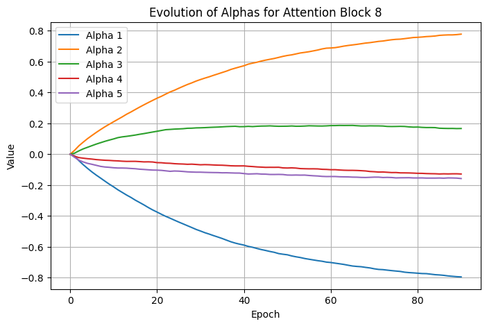
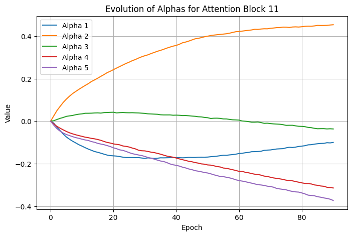

# Optimizing Attention Mechanisms in Transformer Models

## Problem Statement

### What Are We Optimizing?

We seek to overcome the inherent $O(n^2)$ time and memory bottleneck in Transformer attention by **learning which tokens** in the sequence to focus on. Instead of attending to all previous tokens, we aim to develop a **customizable attention mask** that pinpoints only the most relevant parts of the input. We plan to train this customized attention to produce outputs similar to a baseline (unmodified) Transformer. By minimizing the difference (KL-divergence) between the baseline and our custom model, we aim to preserve model quality while reducing computational cost by minimizing the number of tokens required in the attention mechanism.

### Why Does This Problem Matter?

As more research has been done with large language models (LLMs), one common result is increasing the size of the model. In recent years, the size of models have grown exponentially, and models cannot fit in single GPU memory. Thus, one goal now is to use fewer parameters and find ways to represent large models more compactly. Existing research has been done to build more efficient LLMs, such as the Lottery Ticket hypothesis to make smaller networks (find important parts of the network, throw away the rest) and distillation. At the same time, another issue lies with attention.

Transformer-based language models have become central to a wide variety of NLP tasks, but they quickly become impractical for very long sequences due to quadratic complexity. Improving their attention efficiency can:

- **Enable Longer Contexts**: Handle documents or tasks requiring thousands of tokens.
- **Reduce Hardware Costs**: Lower memory usage means more feasible deployment.
- **Maintain Accuracy**: Achieve similar or near-equivalent performance as full attention.

### How Will We Measure Success?

1. **Accuracy Retention**: Does the custom attention model perform comparably to the baseline on text tasks (e.g., perplexity, F1, or other relevant metrics)?
2. **Computational Improvement**: We will track how well the approach scales with sequence length, aiming for reduced memory usage or speed gains.
3. **Distribution Alignment**: A lower KL-divergence between the custom model's outputs and the baseline model signals successful attention optimization.

### What Are Our Constraints?

We are currently focusing on **WikiText-2** as our primary dataset for language modeling. It is freely available, moderate in size (roughly 2 million tokens), and standard for benchmarking. We want to be able to:

- Process sequences of up to 512 tokens (as a starting point) on a single GPU without out-of-memory errors.
- Implement the code in standard PyTorch, avoiding highly specialized CUDA kernels.
- Retain acceptable generation quality while freezing most of the baseline model parameters.
- Compatibility with standard PyTorch APIs (e.g., `nn.MultiheadAttention`).

### What Data Do We Need?

- **WikiText-2** for initial experimentation and evaluation.
- Potentially **WikiText-103** or other larger corpora as we scale up the approach and test longer context windows.
- For thorough testing, we may also include smaller validation sets to measure perplexity and check overfitting.

### What Could Go Wrong?

- **Underfitting**: If the custom mask prunes too aggressively, performance or fidelity may drop significantly.
- **Overhead vs. Benefit**: A clever mask may still impose overhead that negates memory/computational gains if it's not efficiently implemented.
- **Instability**: With a learnable attention mask, training might become unstable or sensitive to hyperparameters.

---

## Technical Approach

### Mathematical Formulation

We define two Transformer models: a **baseline** and a **custom**. If $P_{\text{base}}(\cdot\mid X)$ is the baseline output distribution and $P_{\text{custom}}(\cdot\mid X)$ is our custom model's distribution, we minimize:

$$\mathcal{L} = \mathrm{KL}\bigl(P_{\text{base}} \,\|\, P_{\text{custom}}\bigr)$$

summed over all training examples $X$. This objective encourages the custom attention to preserve the baseline model's behavior.

### Algorithm/Approach Choice and Justification

- **Adaptive Attention Mask**: Long-term, we want to learn a sparse mask or restricted set of tokens that provide sufficient context with fewer computations.
- **KL-Divergence Alignment**: By aligning probabilities, we ensure that any modifications to attention remain faithful to the baseline's predictions.
- **Sub-Quadratic Focus**: The ultimate aim is to reduce attention complexity from $O(n^2)$ to something more tractable for large $n$.

### PyTorch Implementation Strategy

1. **Baseline Model**: A larger, established Transformer architecture loaded from a standard library (e.g., Hugging Face).
2. **Custom Attention Module**: Replace the default attention with a mechanism that only processes a subset of tokens, with learnable parameters dictating which tokens matter most.
3. **Loss Computation**: Compute logits from both models on the same input batch, then apply KL-divergence.
4. **Parameter Updates**: Use standard optimization (e.g., AdamW) to train the new attention module while freezing or partially freezing other layers.

### Measure of Success

1. **Accuracy Retention**:
   - After replacing the attention mechanism with the optimized variant:
     - Maintain $\ge 95\%$ of baseline accuracy
   - Critical tests:
     - **Attention matrix fidelity**: Mean squared error (MSE) $\le 1e-4$ between original and optimized attention probabilities.
     - **Gradient similarity**: Cosine similarity $\ge 0.95$ between gradients of original and optimized attention layers during backward pass.
     - **KL Divergence**: Divergence between the two probability distribution of next token $\le 0.001$.
2. **Memory Efficiency**:
   - **Peak memory reduction**: $\ge 30\%$ for sequences $\ge 1024$ tokens.
   - Measurement:
     - Use `torch.cuda.max_memory_allocated()` to track GPU memory during:
       - **Training**: Forward/backward pass of a single batch.
       - **Inference**: Forward pass only.
     - Use PyTorch's `torch.profiler.profile()` to isolate attention operations.

### Validation Methods

- **Validation Loss**: Track KL-divergence on a held-out set to ensure the custom model matches the baseline distribution over time.
  - Load weights from baseline models (e.g., HuggingFace's `bert-base-uncased`), replace _only_ the attention module, and evaluate **without fine-tuning**.
  - Ensures optimization does not rely on retraining to "recover" lost accuracy.
  - L1 penalty for coefficients of attention masks
- **Perplexity/Accuracy**: Evaluate on standard tasks (e.g., language modeling or classification) to ensure minimal drop in performance.
- **Edge cases**: Sequences with extreme sparsity (e.g., all padding tokens) or high similarity (e.g., repeated tokens).
- **Scalability Tests**: Gradually increase input sequence lengths and measure memory usage, throughput, and any speed improvements.

### Resource Requirements and Constraints

- **Single GPU Usage**: We plan to use one GPU for training and validation on WikiText-2 (with sequences up to 512 tokens).
- **Training Times**: Expect shorter runs (on the order of a few hours) to confirm feasibility.
- **Future Scaling**: After proving the concept, we may switch to a more powerful GPU and larger corpora (WikiText-103 or beyond).

---

## Results

In our previous implementation, we replaced the full self-attention with a custom attention layer that considered a linear combination of three candidate masks: candidate 0 only attends to the last 5 tokens, candidate 1 only attends to the last 10 tokens, and candidate 2 only attends to the first 5 tokens.

Now, we have implemented a custom attention layer that replaces this linear combination with a linear combination of five candidate masks, allowing for **more flexible learnable attention patterns**. Each attention block's attention mask can be optimized during training, allowing the model to learn which tokens are most important. We consider a linear combination of the following candidate masks: last token, 2nd last token, 3rd last token, 4th last token, and 5th last token. We use a weighted linear combination of these attention masks, where the coefficients are tunable parameters. This approach maintains the expressiveness of full attention while providing the potential for optimization through learned sparsity patterns. While the specific choice of the last "5" tokens is arbitrary, there isn't a natural limit to pick. We cannot use a mask for each token as the number of tokens varies as more input text comes in, and we need a fixed number of coefficients to train. For this model, we similarly trained by minimizing KL-divergence between the custom model's outputs and the reference GPT-2. By learning these position-specific patterns, we aim to discover natural sparsity in the attention mechanism that could lead to computational efficiency improvements while preserving model performance.

We included a L1 penalty when optimizing the coefficients of the attention masks so that they are not extremely large, and so that we can interpret which attention masks are significant. We also conducted several L1 regularization penalty experiments. In one such experiment, we replaced the attention layer with two possible candidate masks: first token and all tokens (full attention), with the goal of ensuring that adding regularization does make the coefficient for the first token 0 (we expect the model to not use this first token mask and only consider the full attention mask, since the first token should have little bearing on the future outputs).

We found that over the epochs, alpha1 tended to approach negative infinity, which means this mask is less and less important. (Coefficients of the candidate masks are actually the sigmoid of the alphas). On the other hand, alpha2 did also decrease constantly, but it was still always larger than alpha1. As a result, we can see that the second mask was "more important" than the first, which aligns with what we expected. The reason alpha2 also tended towards negative infinity is likely due to the L1 penalty being enforced too harshly. We have done a few experiments with this coefficient, but will decrease this more to get better representative results in the future, but it is still clear that the "full attention" mask was weighted more than the "first token" mask.

In the future, we intend to extend this approach to **measure the computational and memory usage** of our custom attention implementation, as well as experiment with regularization, penalty, and/or constraints (eg. low rank using SVD) to reduce complexity. We also want to test with both more advanced models beyond GPT-2, and additionally smaller models than can be run locally.

**Key Observations**

- KL-divergence decreases steadily, confirming that the custom model is aligning its output distribution to GPT-2's.
- We **did not** measure or improve memory usage—the code as written does **not** yet aim for sub-quadratic complexity or large-scale efficiency gains.

### Evidence your implementation works

- **Successful Training Loop:** Over 100 epochs, the KL-divergence–based loss with L1 penalty steadily decreased from about 2.144 down to 0.402 on our dataset, indicating the custom attention can mimic the reference model's distributions.
- **Text Generation:** We tested with a few prompts, observing that our custom model produced text in a style similar to GPT-2. The text is not as coherent as the reference model though.
- **Convergence of Attention Masks Coefficients:** Below are graphs of the values of the coefficients of the attention masks for the linear combination of them for specific attention blocks.





_Figure: Evolution of attention mask coefficients during training. Each line represents a coefficient for a different attention pattern. The convergence of these values suggests the model is learning stable attention patterns._

### Basic performance metrics

Here are the loss values (KL-divergence + L1 penalty) across epochs (only partial data shown):

```
Epoch 1 | Loss: 2.1443
Epoch 20 | Loss: 0.6724
Epoch 40 | Loss: 0.5075
Epoch 60 | Loss: 0.4362
Epoch 80 | Loss: 0.4266
Epoch 90 | Loss: 0.4021
```

The consistent downward trend demonstrates that the custom attention mechanism aligns progressively better with the baseline.

### Test case results

Below are selected generation samples using the same prompts for both the reference and custom models. While the custom model's outputs sometimes drift or become less coherent, they still roughly follow the prompts and produce recognizable English words. This shows the model is capturing some of GPT-2's distribution, though it's obviously not perfect.

**Prompt**: Hello, my name is

- **Reference**: Hello, my name is M.E.C.O., I am a member of the Uppsala University Human Sciences Research Council (HUSRC), which works in partnership with other universities like Sweden and Canada to enhance access for young scientists through
- **Custom**: Hello, my name is of the same day The news for the top boardboard-1. However, it was actually make an incredible balance in a large portions to get their favorite "If you don't work with this year:Directional

**Prompt**: The meaning of life is

- **Reference**: The meaning of life is that in this world, God does not make us immortal." "He makes you who are born and died to be the most perfect people when they die. That's why we can't love one another as much anymore,"
- **Custom**: The meaning of life is a lot and the idea, in 2014 – The same or at to protectors are not necessarily can't-bondering this world's latest "I said. We're going back down on Tuesday week from time for example

**Prompt**: In a shocking turn of events,

- **Reference**: In a shocking turn of events, I have been told by one former employee that we did not meet him personally as the head chef at Punta del Fogo in San Salvador. We only met on May 7th and it was confirmed shortly thereafter...
- **Custom**: In a shocking turn of events, and bemooms, for the first day at least two of our friends in Los Angeles Superiority is now I would leave us all-day out of the current as well. The American Idolupli was

**Prompt**: The future of artificial intelligence

- **Reference**: The future of artificial intelligence, and how to use it more effectively in our business contexts We have seen the emergence so far from commercial AI that we are very worried about its potential. It is no longer just a matter for "saying", but
- **Custom**: The future of artificial intelligence and therefore it's latest two other things are just don't get a couple, if we're now I. This is nothinters before he pointedly has been able to be considered the "It was also noted-

We also tried it with some slightly longer prompts:

**Prompt**: In the year 2157, humanity had finally perfected interstellar travel. The first colony ship, brimming with hope and thousands of eager settlers

- **Reference**: In the year 2157, humanity had finally perfected interstellar travel. The first colony ship, brimming with hope and thousands of eager settlers in space… But it took a long time for mankind to realize they were entering uncharted territory – something that
- **Custom**: In the year 2157, humanity had finally perfected interstellar travel. The first colony ship, brimming with hope and thousands of eager settlers to prevent it is your own party members are still more than one of all but that's next week after a new

**Prompt**: The scientist stared at the glowing vial on the laboratory table, her fingers trembling with anticipation. After years of relentless experimentation

- **Reference**: The scientist stared at the glowing vial on the laboratory table, her fingers trembling with anticipation. After years of relentless experimentation and research into food production techniques in other societies, she knew nothing about human consumption when it came to meat products… But one
- **Custom**: The scientist stared at the glowing vial on the laboratory table, her fingers trembling with anticipation. After years of relentless experimentation to be a little more than I do not yet when you'd never put down in particular day or are all manner only one year

**Prompt**: The detective pushed open the heavy oak door, stepping into a room thick with the scent of old books and something more sinister—fear

- **Reference**: The detective pushed open the heavy oak door, stepping into a room thick with the scent of old books and something more sinister—fear. "You're in trouble," he said firmly. "I don't know why you'd come here."
- **Custom**: The detective pushed open the heavy oak door, stepping into a room thick with the scent of old books and something more sinister—fear's been taken over four to be completely in its time for any sortof them both sides. The future later have

### Current Limitations

- **Minimal Dataset**: Synthetic or small text corpora, offering limited insight into real-world performance (we only use 1000 training samples).
- **Limited Mask Optimization**: We used a simple weighted linear combination of attention masks that attend to tokens in specific positions.
- **No Large Model**: GPT-2 was used purely for demonstration; we have not tested on bigger or more modern architectures.

### Resource Usage Measurements

- On one T4 GPU on Google Colab, this took a while to run for 100 epochs (about 30 mins).
- These resource measurements are modest because our demonstration used a restricted sequence length and a small amount of data.

### Unexpected challenges

- **Limited Coherence**: We will need more sophisticated masking to handle longer contexts properly.
- **Overfitting**: Because our dataset was tiny, we saw the model quickly saturate or jump around in text quality, suggesting the need for better regularization.
- **Accuracy Concerns**: Potential accuracy degradation from over-sparsification.

---

## Next Steps

### Immediate improvements needed

- **Extend Training Data:** Use the full WikiText-2 dataset (rather than just 1000 samples) to get more realistic coverage and reduce overfitting.
- **Fine-Tune Hyperparameters:** Adjust learning rates, batch sizes, and sequence lengths to improve stability and convergence.
- **Efficiency and Memory Improvement:** Track speed and memory usage of attention masks.

### Literature review

We conducted a literature review of two papers: "Lexico: Extreme KV Cache Compression via Sparse Coding Over Universal Dictionaries" and "Native Sparse Attention (NSA): A Hardware-Aligned and Trainable Sparse Attention Mechanism", which discuss optimizations to improve model memory usage. (detailed summary in `papers/`.) Lexico uses a KV cache compression technique that leverages sparse coding to represent key-value pairs using a small set of learned universal dictionary vectors. NSA introduces a sparse attention mechanism that incorporates predefined sparsity patterns directly into model training. The approach defines sparse attention templates that match modern hardware capabilities, ensuring both algorithmic and hardware efficiency.These techniques represent complementary approaches to addressing the memory bottlenecks in LLMs: Lexico focuses on compressing the stored intermediate states, while NSA optimizes the attention computation itself.

We will consider further exploring or finding ways to imitiate what these papers have done for their attention mechanism as suggestions for our next steps.

### What You've Learned So Far

- **KL-Divergence Feasibility**: Minimizing KL directly is an effective way to align two models' distributions.
- **Attention Substitution**: Swapping out the standard self-attention module is straightforward if we mirror the input-output shapes and track weights carefully.
