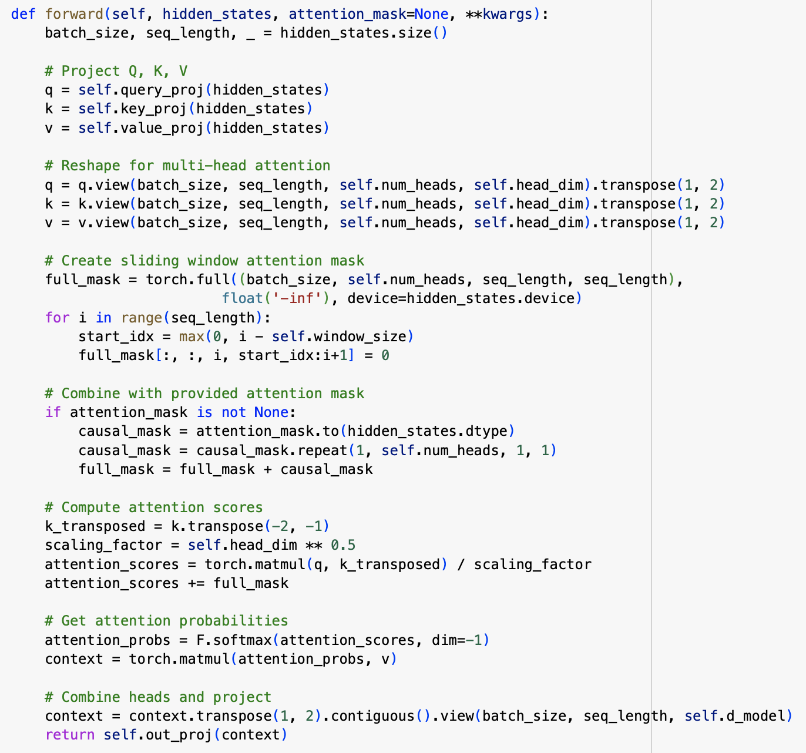
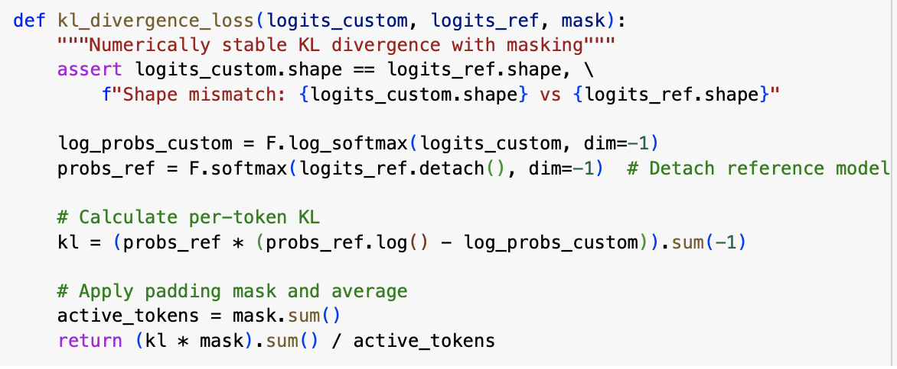

# Optimizing Attention Mechanisms in Transformers

#### Week 4: Project Overview & Initial Results

Chandler Cheung, Charis Gao, Jordan Hochman

---

## Background

- Transformer models have become central to NLP tasks
- In recent years, size of models has grown exponentially
- Key challenge: $O(n^2)$ complexity in attention mechanism
- Growing model sizes create memory constraints
- Need for more efficient attention mechanism without losing performance

---

## Optimization Problem

Develop a customizable attention mask that learns which tokens in the sequence to focus on (instead of attending to all tokens). We plan to train this model with an attention mask to produce outputs similar to a baseline, unmodified Transformer, specifically aiming to preserve model quality while reducing computational cost.

---

## Mathematical Formulation

Core objective: minimize KL-divergence between baseline and custom model
$$\mathcal{L} = \mathrm{KL}\bigl(P_{\text{base}} ,|, P_{\text{custom}}\bigr)$$

#### Success Metrics

- Accuracy retention: comparable performance
- Computational improvement: reduced memory usage or speed gains
- Distribution alignment: low KL-divergence

---

## Current Implementation

- Baseline Model: GPT-2 b/c of unoptimized attention mechanism
- Custom Attention Module: replaced the default full attention with a fixed "last-10-tokens" window with learnable parameters dictating weights for tokens



---

## Current Implementation

- Loss Computation: Compute logits from both models on the same input batch, then apply KL-divergence, trained to minimize this divergence



In the future, will extend approach to learn which tokens matter most and measure memory usage

---

## Initial Results - Training Progress

- Over 100 epochs, the KL-divergence–based loss decreased from 1.61 down to 0.07 on our toy data, indicating the custom attention can mimic the reference model's distributions
- We tested with a few prompts, observing that our custom model produced text in a style similar to GPT-2, though often less coherent due to the limited "last-10-tokens" context

---

## Initial Results - Sample Outputs

```
Prompt: Hello, my name is

Reference: ... I am the founder of Inoscular Robotics ...
Custom: ... I have you doing so much easier than ever ...
```

```
Prompt: The meaning of life is

Reference: ... matter's consciousness. True, you can stop ...
Custom: ... a newbies for what, welcome as an earthquake ...
```

Custom model's outputs sometimes drift or become less coherent, but still roughly follow the prompts and produce recognizable English words --> model captures some of GPT-2's distribution

---

## Current Limitations

- No dynamic mask optimization yet (using fixed "last-10-tokens" window)
- Need to train on a larger dataset (currently using small synthetic dataset)
- No measure of memory or speed usage

---

## Next Steps

- Implement adaptive mask learning
- Extend to full WikiText-2 dataset / more training data
- Optimize hyperparameters

#### Future Ideas

- Look into models besides GPT-2
- Explore alternative approaches: blockwise/local attention, knowledge distillation, etc.

---

# Thank you!

### Any questions?
