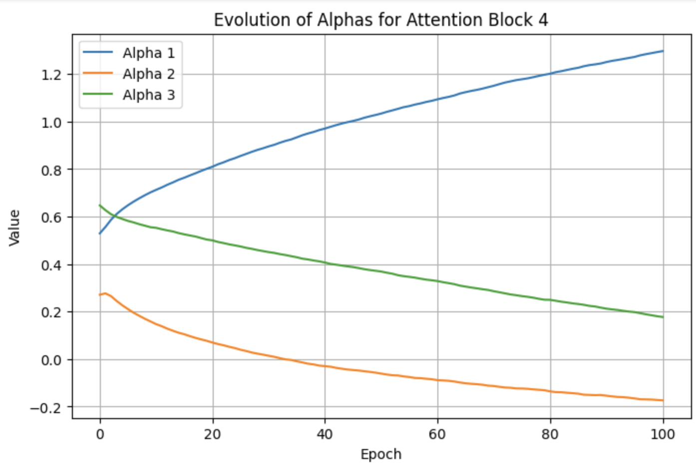
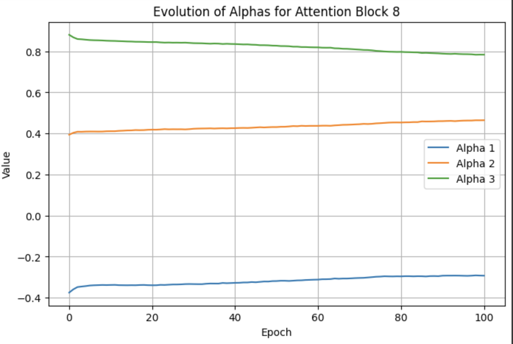

# Optimizing Attention Mechanisms in Transformers

#### Lightning Talk

Chandler Cheung, Charis Gao, Jordan Hochman

---

## Background

- Transformer models have become central to NLP tasks
- In recent years, size of models has grown exponentially
- Key challenge: $O(n^2)$ complexity in attention mechanism
- Growing model sizes create memory constraints
- Need more efficient attention mechanism without degrading performance

---

## Optimization Problem

- Develop customizable attention mask that learns important tokens in sequence to attend to instead of attending to all tokens
- Train model with optimized attention mask to produce outputs similar to a baseline, unmodified transformer
- Preserve model quality while reducing computational cost

---

## Mathematical Formulation

Core objective: minimize KL-divergence between baseline and custom model over all training examples $X$
$$\mathcal{L} = \mathrm{KL}\bigl(P_{\text{base}} \,\|\, P_{\text{custom}}\bigr)$$

#### Metrics

- Accuracy retention: comparable performance
- Computational improvement (sub-quadratic): reduced memory and/or speed gains
- Distribution alignment: low KL-divergence

---

## Current Implementation

- Baseline model: GPT-2 (unoptimized attention mechanism)
- Custom attention module: linear combination of candidate masks
  - Learnable weight parameters w/ L1 penalty (independent for each transformer block/layer)
- Dataset: WikiText-2

```python
def forward(self, hidden_states, attention_mask=None, **kwargs):
    ...
    candidate_masks = self._get_candidate_masks(seq_length, device=device)
    ...
    w = torch.sigmoid(self.alpha)
    ...
    final_mask = torch.sum(w * candidate_masks, dim=2)
    ...
```

---

## Current Implementation

- Loss Computation
  - Compute logits from both models on the same input batch
  - Calculate KL-divergence and minimize

```python
def kl_divergence_loss(logits_custom, logits_ref, mask):
    log_probs_custom = F.log_softmax(logits_custom, dim=-1)
    probs_ref = F.softmax(logits_ref.detach(), dim=-1)  # Detach reference model

    # Calculate per-token KL
    kl = (probs_ref * (probs_ref.log() - log_probs_custom)).sum(-1)

    # Apply padding mask and average
    active_tokens = mask.sum()
    return (kl * mask).sum() / active_tokens
```

---

## Current Results - Training Progress

- Over 100 epochs, loss (KL-divergence) decreased from 2.1470 to 0.3881 on our dataset
  - Custom attention can mimic the reference model's distributions
  - Model successfully learns sparse attention pattern
- Tested with a few prompts, resulting in output text mimicing style similar to GPT-2, though often less coherent due to the limited context

---

## Current Results - Attention Masks Coefficients Convergence

<!-- TODO -->

  

Graphs of evolution of attention mask coefficients during training. Each line represents a coefficient in the attention block. The convergence of these values suggests the model is learning stable attention patterns.

---

## Current Results - Sample Outputs

```
Prompt: Hello, my name is

Reference: Aaron. It took just weeks of work to get this script ...
Custom: in German; "Wulf," which means a new kind of word ...
```

```
Prompt: The meaning of life is

Reference: different when it comes to death. It involves the beginning and end ...
Custom: not a question, however many people are involved in this matter ...
```

- Custom model's outputs sometimes drift or become less coherent
- Follows prompts and produce recognizable English words
- Custom model captures some of GPT-2's output token distribution

---

## Current Results - Regularization

- Included a L1 penalty so we can interpret which attention masks are significant
- L1 regularization experiment: replaced attention layer with 2 possible candidate masks: first token and all tokens (fill attention)

  - Check that regularization makes coefficient for first token 0 (we expect the model to not use this first token mask and only consider the full attention mask, since the first token should have little bearing on future outputs)

  <!-- TODO -->
  <!-- We found that over the epochs, alpha1 tended to approach negative infinity, which means this mask is less and less important. (Coefficients of the candidate masks are actually the sigmoid of the alphas). On the other hand, alpha2 did also decrease constantly, but it was still always larger than alpha1. As a result, we can see that the second mask was "more important" than the first, which aligns with what we expected. The reason alpha2 also tended towards negative infinity is likely due to the L1 penalty being enforced too harshly. We have done a few experiments with this coefficient, but will decrease this more to get better representative results in the future, but it is still clear that the "full attention" mask was weighted more than the "first token" mask. -->

---

## Current Limitations

- Limited mask optimization
  - Currently using simple weighted linear combinations of 3-5 fixed attention masks
- Need to train on larger dataset for more epochs
- No measure of memory or speed usage

---

## Next Steps

- Optimize over more varied candidate masks and matrix families
- Explore regularization, constraints, and penalties
- Implement adaptive mask learning to identify important tokens potentially for each sentence and/or position
- Extend to full WikiText-2 dataset / more training data
- Measure memory usage and speed improvements
- Optimize hyperparameters

---

#### Future Ideas

- Look into models besides GPT-2
  - Research open-source implementations for recent developments in optimizations that affect attention
- Explore alternative approaches: blockwise/local attention, knowledge distillation, etc.

---

# Thank you!

### Any questions?
