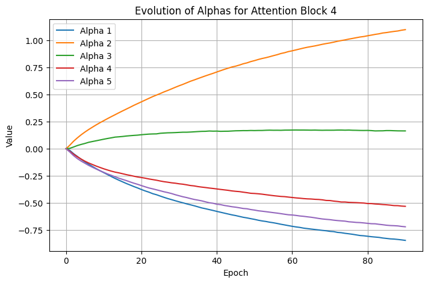

# Optimizing Attention Mechanisms in Transformers

#### Week 10: Project Overview and Results

Chandler Cheung, Charis Gao, Jordan Hochman

---

## Background

- Transformer models have become central to NLP tasks
- In recent years, size of models has grown exponentially
- Key challenge: $O(n^2)$ complexity in attention mechanism
- Growing model sizes create memory constraints
- Need more efficient attention mechanism without degrading performance

---

## Optimization Problem

- Develop customizable attention mask that learns important tokens in sequence to attend to instead of attending to all tokens
- Train model with optimized attention mask to produce outputs similar to a baseline, unmodified transformer
- Preserve model quality while reducing computational cost

---

## Mathematical Formulation

Core objective: minimize KL-divergence between baseline and custom model over all training examples $X$
$$\mathcal{L} = \mathrm{KL}\bigl(P_{\text{base}} \,\|\, P_{\text{custom}}\bigr)$$

#### Metrics

- Accuracy retention: comparable performance
- Computational improvement (sub-quadratic): reduced memory and/or speed gains
- Distribution alignment: low KL-divergence

---

## Implementation

- Baseline model: GPT-2 (unoptimized attention mechanism)
- Dataset: WikiText-2
- Custom attention module versions:
  1. Naive linear combination of candidate masks with learnable weight parameters and L1 penalty
  2. Performer & Kerformer -- kernel approximation of attention mechanism with random and learned feature maps respectively
  3. Native Sparse Attention -- hierarchical attention mechanism with a sliding window

---

## Implementation

- Loss Computation
  - Compute logits from both models on the same input batch
  - Calculate KL-divergence and minimize

```python
def kl_divergence_loss(logits_custom, logits_ref, mask):
    log_probs_custom = F.log_softmax(logits_custom, dim=-1)
    probs_ref = F.softmax(logits_ref.detach(), dim=-1)  # Detach reference model

    # Calculate per-token KL
    kl = (probs_ref * (probs_ref.log() - log_probs_custom)).sum(-1)

    # Apply padding mask and average
    active_tokens = mask.sum()
    return (kl * mask).sum() / active_tokens
```

---

## Naive Linear Combination of Candidate Masks

- Simple weighted linear combinations of 3-5 fixed candidate masks (eg. past 5 tokens, past 10 tokens, one-hot encoding of tokens, etc.)
- Coefficients are tunable parameters
- L1 penalty so coefficients are not extremely large and so that we can interpret which attention masks are significant

---

## Performers and Kerformers

- Use kernel-based approximations to replace softmax attention, reducing complexity to linear time
- **Performers** rely on random feature maps, while **Kerformers** improve this with structured, data-aware projections that are learned—making both efficient for long-sequence modeling without major accuracy loss

---

## Native Sparse Attention

- Hardware-optimized and end-to-end trainable sparse attention mechanism
- Reduces computational overhead using hierarchical approach
  - Compressed representations of tokens for global context
  - Selectively retains the most relevant tokens for local precision
  - Employs a sliding window mechanism to maintain continuity in processing sequential tokens

---

## Native Sparse Attention - Diagram


---

## Current Results - Naive Linear Combination

- Over 100 epochs, loss decreased from 2.1470 to 0.3881
  - Custom attention can mimic the reference model's distributions
- Tested with a few prompts, resulting in output text mimicing style similar to GPT-2 (follows prompts + produces recognizable words), though often drifts/is less coherent due to the limited context

```
Prompt: Hello, my name is
Reference: Aaron. It took just weeks of work to get this script ...
Custom: in German; "Wulf," which means a new kind of word ...

Prompt: The meaning of life is
Reference: different when it comes to death. It involves the beginning and end ...
Custom: not a question, however many people are involved in this matter ...
```

---

## Current Results - Naive Linear Combination Attention Masks Coefficients Convergence

  

Graphs of evolution of attention mask coefficients during training. Each line represents a coefficient in the attention block. The convergence of these values suggests the model is learning stable attention patterns.

---

## Current Results - Performer/Kerformer

<style scoped>
section {
  font-size: 30px;
}
</style>

- Work in progress - generates non-coherent English text
- Trained for 10 epochs, loss decreased from 3.2546 to 2.9471
- Issues with NaN and division by zero, possibly because of overflow/underflow; addressed by adding small epsilons
    - Implemented by minimizing KL-divergence with base model, but Performers don't add parameters, so it should directly minimize target loss

```
Prompt: Hello, my name is
Reference: Kipi (I think of you as his friend) and I'm looking for a new job at the company ...
Custom: to the city of a big and his personal information that he were in an important ...

Prompt: The future of artificial intelligence
Reference: will involve creating a machine with the ability to solve complex problems ...
Custom: and the new on the current I didn't often, if you will also seen a few days  ...
```

---

## Current Results - NSA

- Work in progress
- Trained for 10 epochs, loss decreased from 15.28 to 14.18
- Generated outputs consist of random symbols
- Attempted to address these by increasing the context size and modifying the parameters for the selective attention and sliding window mechanisms; new results still yielded outputs of only `!`

```
Prompt: Artificial intelligence
Reference: is a new field of research that has been in the works for a while now ...
Custom: %&&&(&&,&&&0&0,0&,000&00&00000000000000000&0000,0&000,0,0&[0000000&000[00[0&0,0 ...
Custom: !!!!!!!!!!!!!!!!!!!!!!!!!!!!!!!!!!!!!!!!!!!!!!!!!!!!!!!!!!!!!!!!!!!!!!!!!!!!!!!!!!!!!!  ...
```

---

## Current Limitations and Direct Next Steps

- Modify/debug implementation of Performer/Kerformer and NSA so that coherent English words are produced --> currently accuracy concerns / limited coherence
- Need to train on larger dataset for more epochs

---

## Further Steps

- No measure of memory or speed usage
- Experiment with regularization, penalty, and/or constraints
- Testing models other than GPT2
- Test with different training datasets
- Measure memory usage and speed improvements
- Optimize hyperparameters

---

# Thank you!

### Any questions?
